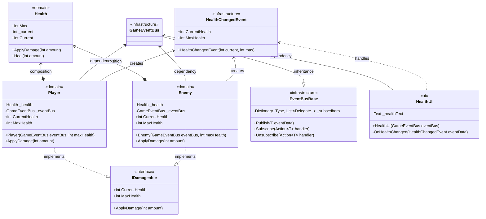
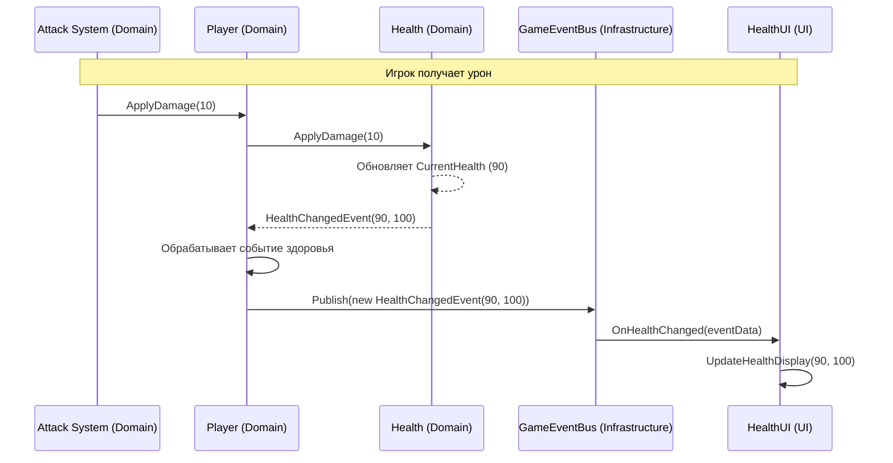

# Примеры кода
## Содержание

[Примеры кода — слоистая архитектура Unity](#примеры-кода-слоистая-архитектура-unity)
1. [Модели и диаграммы](#1-модели-и-диаграммы)
  - 1.1 [Классы и слои](#11-классы-и-слои)
  - 2.1 [Последовательность событий (Event Flow)](#12-последовательность-событий-event-flow)
3. [Реализация классов](#2-реализация-классов)
  - 2.1 [Infrastructure: шина событий](#21-infrastructure-шина-событий)
  - 2.2 [Domain: здоровье и игрок](#22-domain-здоровье-и-игрок)
  - 2.3 [UI слой](#23-ui-слой)

   ---
   
## Примеры кода — слоистая архитектура Unity
### 1. Модели и диаграммы
#### 1.1 Классы и слои

#### 1.2 Последовательность событий (Event Flow)


---

### 2. Реализация классов

#### 2.1 Infrastructure: шина событий
```csharp
public interface IEventBus
{
    void Publish<T>(T eventData) where T : struct;
    void Subscribe<T>(Action<T> handler) where T : struct;
}

public class EventBus : IEventBus
{
    private readonly Dictionary<Type, List<Delegate>> _subscribers = new();

    public void Publish<T>(T eventData) where T : struct
    {
        if (_subscribers.TryGetValue(typeof(T), out var handlers))
        {
            foreach (var handler in handlers.Cast<Action<T>>())
            {
                handler.Invoke(eventData);
            }
        }
    }

    public void Subscribe<T>(Action<T> handler) where T : struct
    {
        var type = typeof(T);
        if (!_subscribers.ContainsKey(type)) 
            _subscribers[type] = new List<Delegate>();
        
        _subscribers[type].Add(handler);
    }
}

// Событие изменения здоровья
public struct HealthChangedEvent
{
    public int CurrentHealth { get; }
    public int MaxHealth { get; }
    
    public HealthChangedEvent(int current, int max)
    {
        CurrentHealth = current;
        MaxHealth = max;
    }
}
```
> Вместо структур вполне допустимо использовать обычные классы, будет меньше аллокаций
#### 2.2 Domain: здоровье и игрок

```csharp
public struct HealthChanged
{
    public int Current { get; }
    public int Max { get; }

    public HealthChanged(int current, int max)
    {
        Current = current;
        Max = max;
    }
}

public class Health
{
    public int MaxHealth { get; private set; }
    public int CurrentHealth { get; private set; }

    public event Action<HealthChanged>? HealthChangedEvent;
    public event Action? Died;

    public Health(int maxHealth)
    {
        MaxHealth = maxHealth;
        CurrentHealth = maxHealth;
    }

    public void ApplyDamage(int amount)
    {
        CurrentHealth = Math.Max(0, CurrentHealth - amount);
        
        HealthChangedEvent?.Invoke(new HealthChanged(CurrentHealth, MaxHealth));

        if (CurrentHealth <= 0)
        {
            Died?.Invoke();
        }
    }
}

public class Player : IDamageable
{
    private readonly Health _health;
    private readonly IEventBus _eventBus;

    public Player(IEventBus eventBus, int maxHealth)
    {
        _eventBus = eventBus;
        _health = new Health(maxHealth);

        _health.HealthChangedEvent += OnHealthChanged;
        _health.Died += OnDeath;
    }

    public void ApplyDamage(int amount)
    {
        _health.ApplyDamage(amount);
    }

    private void OnHealthChanged(HealthChanged evt)
    {
        _eventBus.Publish(new HealthChangedEvent(evt.Current, evt.Max));
    }

    private void OnDeath()
    {
        _eventBus.Publish(new PlayerDiedEvent());
    }
}
```

#### 2.3 UI слой

```csharp
public class HealthUI : MonoBehaviour
{
    [SerializeField] private Text _healthText;
    private IEventBus _eventBus;

    [Inject]
    public void Construct(IEventBus eventBus)
    {
        _eventBus = eventBus;
        _eventBus.Subscribe<HealthChangedEvent>(OnHealthChanged);
    }

    private void OnHealthChanged(HealthChangedEvent eventData)
    {
        _healthText.text = $"Health: {eventData.CurrentHealth}/{eventData.MaxHealth}";
    }

    private void OnDestroy()
    {
        _eventBus.Unsubscribe<HealthChangedEvent>(OnHealthChanged);
    }
}
```
