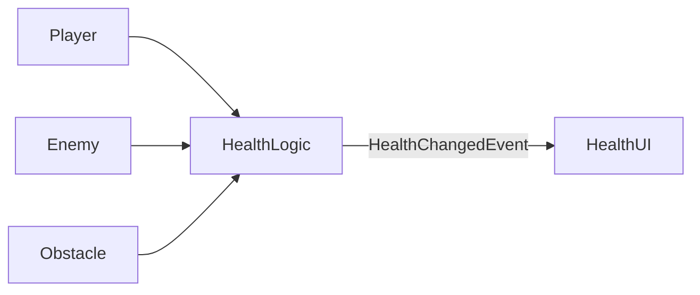

### Типичные ошибки при внедрении

#### 1. Нарушение в Domain слое
**Ошибка:** Использование Unity API в доменных объектах

```csharp
// ПЛОХО: Domain слой не должен зависеть от Unity
public class Health
{
    public void ApplyDamage(int amount)
    {
        // Неправильно: использование Time.deltaTime в доменной логике
        float damageOverTime = amount * Time.deltaTime;
        _currentHealth -= (int)damageOverTime;
        
        // Неправильно: использование Debug.Log в доменном слое
        Debug.Log($"Health reduced to {_currentHealth}");
    }
}
```

**Решение:** Перенести тайминг в Application слой, логирование — в Infrastructure

#### 2. Нарушение в Application слое
**Ошибка:** Прямое взаимодействие с Presentation-компонентами

```csharp
// ПЛОХО: Application слой не должен напрямую взаимодействовать с UI
public class PlayerEntity : MonoBehaviour
{
    private Health _health;
    private PlayerHealthUI _healthUI; // Прямая зависимость от UI
    
    public void Initialize()
    {
        _health = new Health(100);
        _health.OnHealthChanged += UpdateHealthUI; // Прямой вызов UI
    }
    
    private void UpdateHealthUI(int value)
    {
        // Прямое изменение Presentation-компонента
        _healthUI.SetHealth(value); 
    }
}
```

**Решение:** Использовать EventBus для оповещения об изменениях

#### 3. Нарушение в Presentation слое
**Ошибка:** Прямая подписка на доменные события

```csharp
// ПЛОХО: Presentation слой не должен знать о доменных событиях
public class HealthUI : MonoBehaviour
{
    private PlayerEntity _player; // Прямая зависимость от Application
    
    private void Start()
    {
        // Прямая подписка на доменное событие
        _player.Health.OnHealthChanged += UpdateUI; 
    }
    
    private void UpdateUI(int value)
    {
        // Логика отображения
    }
}
```

**Решение:** Подписываться только на инфраструктурные события через EventBus

#### 4. Нарушение модульной автономности
**Ошибка:** Вызов методов другого модуля через FindObjectOfType

```csharp
// ПЛОХО: Нарушение автономности модулей
public class QuestService : MonoBehaviour
{
    public void CompleteQuest(string questId)
    {
        // Прямой поиск и вызов другого модуля
        var inventory = FindObjectOfType<InventoryService>();
        inventory.GiveReward(questId);
    }
}
```

**Решение:** Использовать события для межмодульного взаимодействия

### Как инициализировать систему при запуске?

Порядок инициализации критически важен для правильной работы архитектуры. Вот последовательность действий:

1. **Zenject-биндинги:** Настройка контейнера зависимостей
   - Регистрация сервисов и фабрик
   - Настройка жизненного цикла объектов
   - Пример: `Container.Bind<IEventBus>().To<EventBus>().AsSingle()`

2. **Создание Domain-объектов:**
   - Создание доменных сущностей через фабрики или напрямую
   - Инициализация начального состояния
   - Пример: `var player = new Player(100);`

3. **Инициализация Application-адаптеров:**
   - Создание и настройка MonoBehaviour-адаптеров и сервисов
   - Подписка на доменные события
   - Пример: `playerEntity.Initialize();`

4. **Подписка на события:**
   - Настройка обмена данными через EventBus
   - Пример: `_eventBus.Subscribe<PlayerDeathEvent>(HandleDeath);`

5. **Инициализация Presentation-компонентов:**
   - Подготовка UI и визуальных компонентов
   - Пример: `healthBar.Initialize();`

**Кто отвечает за жизненный цикл:**
- **Initialize():** Application-адаптеры (MonoBehaviour и сервисы), Presentation-компоненты (UI, аниматоры). Вызывается после создания всех зависимостей
- **Tick() / Update():** Только Application-адаптеры (MonoBehaviour). Для передачи Unity-специфичных данных в доменную логику. Presentation-компоненты НЕ должны иметь Tick()
- **Dispose() / OnDestroy():** Application-адаптеры и Presentation-компоненты. Отписка от событий, очистка временных ресурсов

### Производительность и оптимизация

#### Частота событий
**Проблема:** События через EventBus имеют накладные расходы по сравнению с прямыми вызовами
**Решение:** Не используйте события для частых обновлений (каждый кадр)
**Рекомендация:** Используйте события для редких, значимых изменений (смерть игрока, завершение квеста), а для частых обновлений (каждый кадр) используйте прямые вызовы через интерфейсы

#### Action vs EventBus
- **Action/event:** Быстрее, меньше накладных расходов, но создает прямую зависимость
- **EventBus:** Медленнее, но обеспечивает полную слабую связность

**Рекомендация:**
- Используйте Action внутри одного модуля
- Используйте EventBus для межмодульного взаимодействия
- Для критичных по производительности частей (например, физика) используйте прямые вызовы

#### Утечки памяти
**Проблема:** Неочищенные подписки на события приводят к утечкам памяти
**Решение:** Всегда отписывайтесь в OnDestroy или Dispose
**Рекомендация:** Используйте методы Initialize/Dispose для управления подписками, а не Start/OnDestroy

#### Оптимизация для мобильных устройств
**Проблема:** Ограниченные ресурсы на мобильных устройствах
**Решение:**
- Группируйте события (например, вместо 10 событий за кадр — одно с массивом данных)
- Используйте object pooling для событий
- Избегайте частых аллокаций в событиях

#### Рекомендации по выбору механизма связи

| Сценарий | Рекомендуемый подход |
|----------|----------------------|
| Внутри одного модуля | Action/event |
| Межмодульное взаимодействие | EventBus |
| Критичные по производительности участки | Прямые вызовы через интерфейсы |
| Одноразовые события (инициализация) | EventBus |
| Частые обновления (каждый кадр) | Прямые вызовы или shared state |

### Минимизация использования MonoBehaviour

MonoBehaviour-скрипты нужны Unity для прикрепления компонентов к игровым объектам, но они накладны. В официальной документации Unity указывается: «ScriptableObjects легче, чем MonoBehaviours, и не несут накладных расходов, связанных с последними».

Аналогично Zenject подчёркивает: иногда предпочтительнее избежать «избыточного веса» MonoBehaviour и использовать обычные C# классы.

Таким образом бизнес-логику рекомендуется выносить в независимые классы (или ScriptableObject), а MonoBehaviour применять лишь для интеграции с Unity (отображение, ввод, управление сценой и т.д.).

**Важное уточнение:** MonoBehaviour-скрипты, которые выступают в роли композитов доменных сущностей, относятся к прикладному слою (Application), а не к Presentation-слою. Это ключевое различие, которое улучшает архитектуру:
- Presentation-слой содержит только компоненты, отвечающие за визуализацию и ввод
- Прикладной слой содержит MonoBehaviour, которые управляют доменной логикой и её жизненным циклом

**Примеры**

**Пример (здоровье):** Логику «здоровья» можно вынести в отдельный класс или ScriptableObject (не желательно), а не использовать MonoBehaviour. Например, доменная модель Health публикует события при получении урона, а MonoBehaviour-скрипт лишь визуализирует текущее значение. Компонент, отвечающий за здоровье и получение урона, можно прилепить и игроку, и противникам, и даже препятствиям. Сам MonoBehaviour может быть просто композитом, который содержит скрипт здоровья и предоставляет его другим объектам через интерфейсы (контракты).

Аналогичный подход используется и в других системах (очки опыта, инвентарь и т.д.): их данные остаются в простых классах или данных, а MonoBehaviour-скрипты только обрабатывают события.



### Примеры кода

**Плохо:**
```csharp
public class Player : MonoBehaviour
{
    // Движение
    public float speed = 5f;

    // Здоровье
    public int Health = 100;

    // Атака
    public int AttackDamage = 10;

    void Update()
    {
        HandleMovement();
        CheckHealth();
    }

    void HandleMovement()
    {
        float h = Input.GetAxis("Horizontal");
        float v = Input.GetAxis("Vertical");
        Vector3 move = new Vector3(h, 0, v) * speed * Time.deltaTime;
        transform.Translate(move);
    }

    void TakeDamage(int damage)
    {
        Health -= damage;
        if (Health <= 0)
        {
            Die();
        }
    }

    void Die()
    {
        Debug.Log("Player died");
    }

    void CheckHealth()
    {
        if (Health < 50)
        {
            Debug.Log("Health low!");
        }
    }

    void Attack()
    {
        Debug.Log("Player attacks for " + AttackDamage);
        // Логика атаки
    }
}
```

**Хорошо:**
```csharp
public interface IDamageable
{
    int CurrentHealth { get; }
    int MaxHealth { get; }

    void ApplyDamage(int amount);
    void Heal(int amount);

    event Action<int> OnHealthChanged; // new value
    event Action OnDeath;
}

public class Health
{
    public int Max { get; private set; }
    private int _current;
    public int Current => _current;

    public event Action<int> OnHealthChanged;
    public event Action OnDeath;

    public Health(int max)
    {
        Max = Math.Max(1, max);
        _current = Max;
    }

    public void ApplyDamage(int amount)
    {
        // Apply damage
    }

    public void Heal(int amount)
    {
        // Heal
    }
}

public class Player : IDamageable
{
    private readonly Health _health;
    public int CurrentHealth => _health.Current;
    public int MaxHealth => _health.Max;

    public event Action<int> OnHealthChanged;
    public event Action OnDeath;

    public Player(int maxHealth)
    {
        _health = new Health(maxHealth);
        _health.OnDeath += HandleDeath;
        _health.OnHealthChanged += value => OnHealthChanged?.Invoke(value);
    }

    public void ApplyDamage(int amount) => _health.ApplyDamage(amount);
    public void Heal(int amount) => _health.Heal(amount);

    private void HandleDeath()
    {
        OnDeath?.Invoke();
        // domain reaction: e.g. set state, notify systems — не Presentation, не сцена
        // например: IsAlive = false; Respawn logic elsewhere.
    }
}

// И другие сущности подобным образом
```

### Как начать с этой архитектуры?

**Пошаговое руководство для новичков**

1. **Создайте Domain-класс (например, Health)**
```csharp
public class Health
{
    public int Max { get; }
    private int _current;
    public int Current => _current;

    public event Action<int> OnHealthChanged;
    public event Action OnDeath;

    public Health(int max)
    {
        Max = max;
        _current = max;
    }

    public void ApplyDamage(int amount)
    {
        _current = Math.Max(0, _current - amount);
        OnHealthChanged?.Invoke(_current);

        if (_current <= 0)
        {
            OnDeath?.Invoke();
        }
    }
}
```
- Убедитесь, что класс не использует Unity API
- Проверьте, что все зависимости — только через конструктор

2. **Создайте Application-адаптер (PlayerEntity)**
```csharp
public class PlayerEntity : MonoBehaviour, IInitializable, ITickable
{
    [Inject] private IEventBus _eventBus;

    private Health _health;

    public void Initialize()
    {
        _health = new Health(100);
        _health.OnDeath += HandleDeath;
        _health.OnHealthChanged += value => 
            _eventBus.Fire(new HealthChangedEvent(value));
    }

    public void Tick()
    {
        // Обработка ввода и передача в доменную логику
        float h = Input.GetAxis("Horizontal");
        float v = Input.GetAxis("Vertical");
        // ...передаем в Movement
    }

    private void HandleDeath()
    {
        _eventBus.Fire<PlayerDeathEvent>();
        Destroy(gameObject);
    }
}
```
- Убедитесь, что нет прямых ссылок на UI
- Проверьте, что все Unity-специфичные операции в Tick()

3. **Настройте Zenject-биндинги**
```csharp
public class GameInstaller : MonoInstaller
{
    public override void InstallBindings()
    {
        // Инфраструктурные сервисы
        Container.Bind<IEventBus>().To<EventBus>().AsSingle();

        // Application слой
        Container.Bind<IInitializable>().To<PlayerEntity>().FromNewComponentOnNewGameObject().AsSingle();

        // Domain слой (если требуется)
        // Container.Bind<Health>().AsSingle(); // Не рекомендуется для доменных объектов
    }
}
```
- Убедитесь, что Domain-объекты не регистрируются в контейнере
- Проверьте, что Presentation-компоненты не внедряются в Application

4. **Подпишитесь на событие через EventBus в Presentation**
```csharp
public class HealthBar : MonoBehaviour
{
    [Inject] private IEventBus _eventBus;

    private Slider _slider;

    private void Awake()
    {
        _slider = GetComponent<Slider>();
    }

    public void Initialize()
    {
        _eventBus.Subscribe<HealthChangedEvent>(OnHealthChanged);
    }

    private void OnDestroy()
    {
        _eventBus.Unsubscribe<HealthChangedEvent>(OnHealthChanged);
    }

    private void OnHealthChanged(HealthChangedEvent @event)
    {
        _slider.value = @event.Value;
    }
}
```
- Убедитесь, что подписка происходит только через Initialize()
- Проверьте, что нет прямых ссылок на PlayerEntity

5. **Проверьте, что Domain не зависит от Unity**
- Запустите unit-тесты для Health без запуска Unity
- Убедитесь, что в классе нет ссылок на UnityEngine
- Проверьте, что все события обрабатываются правильно

### Отладка и логирование

#### Как отследить источник события?
- **Добавьте метаданные в события:** Расширьте базовый класс сигнала для включения информации об источнике
```csharp
public class HealthChangedEvent
{
    public int Value { get; }
    public string Source { get; } // Например, "Player", "Enemy"

    public HealthChangedEvent(int value, string source)
    {
        Value = value;
        Source = source;
    }
}
```
- **Используйте отладочный режим шины событий:** Включите логирование всех событий в Development-сборках
```csharp
public class EventBus : IEventBus
{
    public void Fire<T>(T @event) where T : struct
    {
#if DEBUG
        Debug.Log($"[EventBus] Firing {typeof(T).Name}");
#endif
        // Логика отправки события
    }
}
```

#### Как избежать утечек памяти при подписках?
- **Всегда отписывайтесь в OnDestroy/Dispose:** Используйте парные методы Initialize/Dispose
```csharp
public class HealthBar : MonoBehaviour
{
    [Inject] private IEventBus _eventBus;

    public void Initialize()
    {
        _eventBus.Subscribe<HealthChangedEvent>(OnHealthChanged);
    }

    private void OnDestroy()
    {
        _eventBus.Unsubscribe<HealthChangedEvent>(OnHealthChanged);
    }
}
```
- **Используйте Weak References для событий:** Для долгоживущих объектов
- **Регулярно проверяйте утечки:** Используйте профилировщик памяти Unity

#### Где логировать ошибки?
- **Infrastructure слой:** Все технические ошибки (сеть, файлы, события)
```csharp
public class EventBus : IEventBus
{
    private readonly ILogger _logger;

    public EventBus(ILogger logger)
    {
        _logger = logger;
    }

    public void Fire<T>(T @event) where T : struct
    {
        try
        {
            // Отправка события
        }
        catch (Exception ex)
        {
            _logger.LogError($"Error firing event {typeof(T).Name}: {ex.Message}");
        }
    }
}
```
- **Application слой:** Ошибки оркестрации и жизненного цикла
- **Domain слой:** Не логируйте ошибки в Domain — передавайте их через события

### Инструменты для отладки архитектуры

- **Визуализация событий:** Создайте инструмент в рантайме для отслеживания потока событий
- **Архитектурные тесты:** Напишите unit-тесты, проверяющие зависимости между слоями
```csharp
[Test]
public void DomainLayer_ShouldNotDependOnUnity()
{
    var domainTypes = Assembly.GetAssembly(typeof(Health))
        .GetTypes()
        .Where(t => t.Namespace.Contains("Domain"));

    foreach (var type in domainTypes)
    {
        var references = type.GetReferencedAssemblies();
        Assert.False(references.Any(r => r.Name == "UnityEngine"));
    }
}
```

### Принцип выбора архитектуры

Хотя в документе описаны рекомендации по слоям, модулям, системам, Zenject и взаимодействию между ними, конечное решение о конкретной реализации архитектуры всегда остаётся за разработчиком или тим-лидом проекта.

Рекомендации служат ориентиром и помогают соблюсти слабую связность, модульность и управляемость системы.

В реальном проекте могут возникнуть ситуации, когда удобнее слегка отклониться от правил (например, использовать прямую DI-связь между системами для упрощения логики или ускорения разработки).

Выбор конкретных паттернов, способов оркестрации систем и детализации слоёв всегда определяется командой исходя из требований проекта, сроков и масштабируемости.

**Идея:** документ задаёт архитектурный каркас и лучшие практики, но не заменяет здравый смысл и опыт разработчиков.
