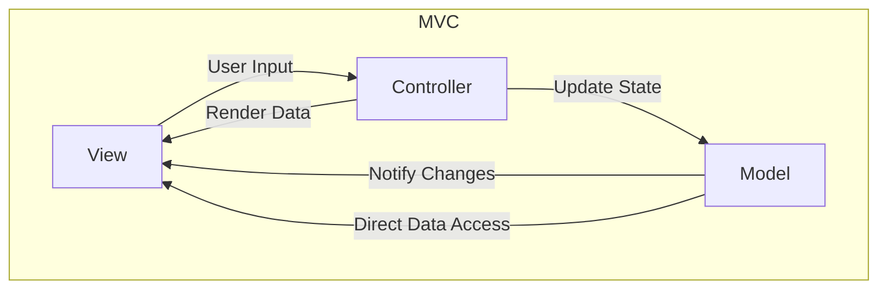
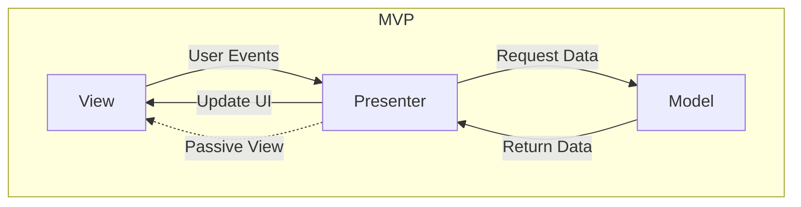
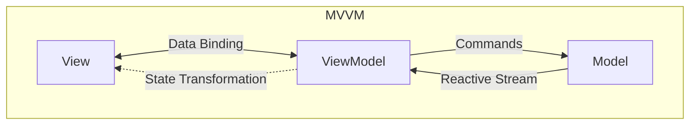

```mermaid
flowchart TD
    subgraph MVC
        A[View] -->|User Input| B[Controller]
        B -->|Update State| C[Model]
        C -->|Notify Changes| A
        B -->|Render Data| A
        C -->|Direct Data Access| A
    end
```

```mermaid
flowchart TD
    subgraph MVP
        A[View] -->|User Events| B[Presenter]
        B -->|Update UI| A
        B -->|Request Data| C[Model]
        C -->|Return Data| B
        B -.->|Passive View| A
    end
```

```mermaid
flowchart TD
    subgraph MVVM
        A[View] <-->|Data Binding| B[ViewModel]
        B -->|Commands| C[Model]
        C -->|Reactive Stream| B
        B -.->|State Transformation| A
    end
```
