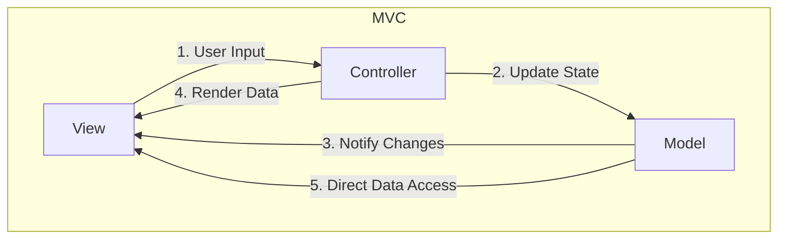
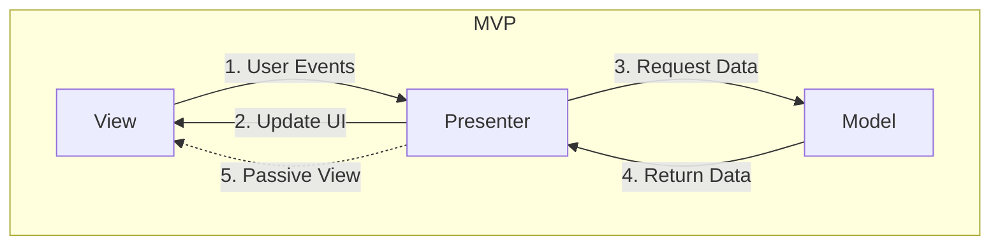
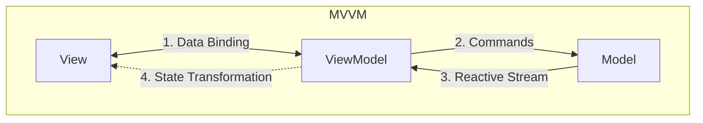

```mermaid
flowchart TD
    subgraph MVC
        A[View] -->|1. User Input| B[Controller]
        B -->|2. Update State| C[Model]
        C -->|3. Notify Changes| A
        B -->|4. Render Data| A
        C -->|5. Direct Data Access| A
    end
```

```mermaid
flowchart TD
    subgraph MVP
        A[View] -->|1. User Events| B[Presenter]
        B -->|2. Update UI| A
        B -->|3. Request Data| C[Model]
        C -->|4. Return Data| B
        B -.->|5. Passive View| A
    end
```

```mermaid
flowchart TD
    subgraph MVVM
        A[View] <-->|1. Data Binding| B[ViewModel]
        B -->|2. Commands| C[Model]
        C -->|3. Reactive Stream| B
        B -.->|4. State Transformation| A
    end
```
