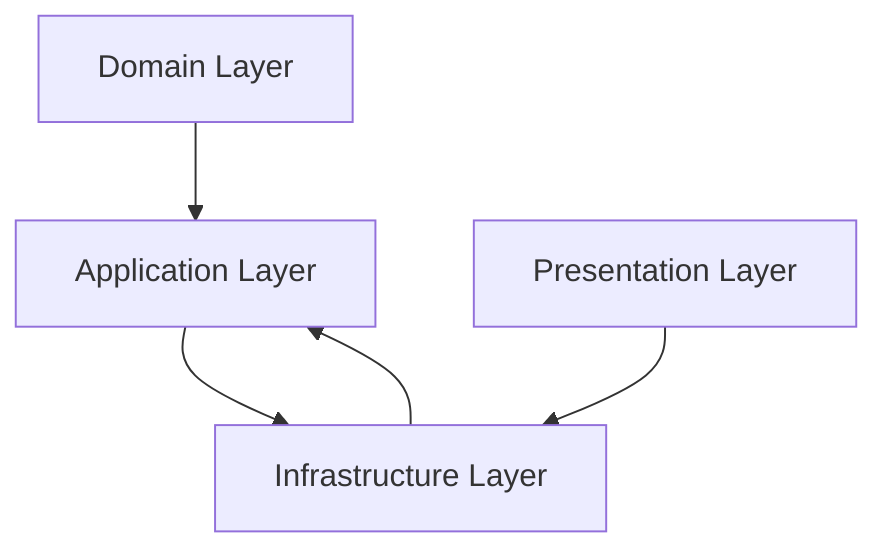
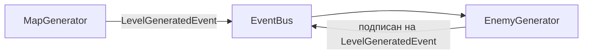
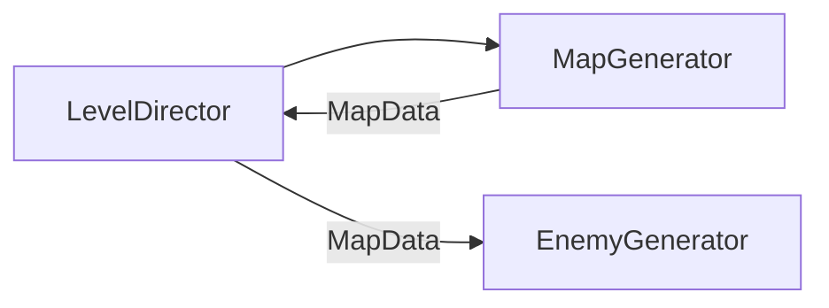

## Модульно-слойная архитектура Unity

Проект организован по четырехслойной архитектуре: Доменный слой, Прикладной слой (Application), Инфраструктурный слой и Presentation-слой. Каждый слой выполняет свою роль и взаимодействует с остальными через строго определенные интерфейсы и события, что обеспечивает слабую связность компонентов.

### Доменный слой (Domain)

Доменный слой реализует бизнес-логику приложения. Содержит сущности предметной области, доменные сервисы и бизнес-правила. Ключевой момент: доменный слой полностью изолирован и не имеет зависимостей от каких-либо других слоев системы. Все значимые действия и изменения состояния публикуются через доменные события (Action/event), которые обрабатываются в прикладном слое. Код доменного слоя полностью тестируемый и не зависит от Unity-специфичных классов. Например, доменный класс «не содержит логики визуализации, а лишь управляет данными».

**Границы слоя — что НЕ должно быть в Domain**
- Нет ссылок на Unity API (Transform, GameObject, Time и т.д.)
- Нет использования EventBus или инфраструктурных сервисов
- Нет логирования через Debug.Log или аналоги
- Нет ссылок на MonoBehaviour или ScriptableObject
- Нет прямых зависимостей от других слоев

### Прикладной слой (Application)

Прикладной слой (Application) является мостом между доменным слоем и остальной системой. Он отвечает за оркестрацию доменной логики и управление её жизненным циклом. Этот слой зависит от доменного слоя и инфраструктурного слоя, но не от Presentation-слоя.

**Назначение слоя:**
- Содержит композиты и сервисы, управляющие доменной логикой
- Включает `MonoBehaviour`-адаптеры (например, `PlayerEntity`) и C#-сервисы (например, `QuestService`)
- Отвечает за:
  - Подписку на события доменных сущностей (через `Action`/`event`)
  - Перенаправление событий в инфраструктуру (например, `EventBus`)
  - Предоставление API для Presentation-слоя и других систем
  - Управление жизненным циклом доменных сущностей
- Не содержит бизнес-правил — только оркестрацию
- Может быть привязан к сцене через `MonoBehaviour`, но не является частью Presentation-слоя

**Границы слоя — что НЕ должно быть в Application**
- Нет прямого изменения Presentation-компонентов (например, через GetComponent)
- Нет реализации бизнес-правил — только оркестрация
- Нет прямых зависимостей от Presentation-слоя
- Нет логики, связанной с визуализацией или анимацией

### Инфраструктурный слой (Infrastructure)

Инфраструктурный слой содержит технические сервисы и утилиты: шину событий (Event Bus), сервисы обмена данными между слоями, реализацию внешних API, менеджеры ресурсов, логирование, работу с файлами и, возможно, БД, управление сохранением/загрузкой данных. Этот слой предоставляет сервисы для Application и Presentation слоев, но не зависит от них.

Важно: инфраструктурный слой не знает о деталях доменной логики. Его роль — посредник между слоями и внешней средой: он принимает и отправляет команды и события из домена/Application и общается с файловой системой, сетью и прочими ресурсами.

**Границы слоя — что НЕ должно быть в Infrastructure**
- Нет знания о доменных сущностях (должен работать с абстрактными событиями)
- Нет бизнес-логики — только техническая реализация
- Нет прямого доступа к Presentation-компонентам
- Нет реализации игровых механик

### Presentation-слой

Presentation-слой включает не только экраны и элементы интерфейса, но и аниматоры, визуальные эффекты и другие компоненты, отвечающие за отображение данных. Этот слой зависит только от инфраструктурного слоя через шину событий и сервисы, но не имеет прямых зависимостей от доменного или прикладного слоев.

Presentation-слой отвечает только за отображение данных и взаимодействие с игроком, не содержит бизнес-логики. Он не знает о доменных сущностях напрямую – взаимодействие с бизнес-логикой происходит только через инфраструктуру (шину событий). Компоненты Presentation-слоя максимально автономны и слабо связаны друг с другом: каждый отвечает за свою часть интерфейса и получает данные из общего источника или по событиям. Например, MonoBehaviour должен лишь визуализировать данные, но не хранить их и не выполнять сложную логику.

**Границы слоя — что НЕ должно быть в Presentation**
- Нет бизнес-логики — только визуализация
- Нет доменных объектов — только данные для отображения
- Нет прямого доступа к Application-адаптерам
- Нет изменения состояния игры (кроме ввода от пользователя)

### Таблица границ слоёв

| Слой | Доменные сущности | События | Зависимости |
|------|-------------------|---------|-------------|
| Domain | Да | Нет (только доменные события через Action/event) | Нет (чистая C# логика) |
| Application | Да (адаптеры) | Да (для оркестрации) | Только Domain и Infra |
| Infrastructure | Нет | Да (реализация шины) | Нет (только предоставляет API) |
| Presentation | Нет (только визуализация) | Да (подписка на события) | Только через Infra |

### Взаимодействие слоёв

Таким образом:
- Domain является независимым ядром
- Application зависит от Domain и Infrastructure
- Infrastructure предоставляет сервисы Application и Presentation
- Presentation зависит только от Infrastructure

Все взаимодействие с инфраструктурой происходит через:
- Application слой (для бизнес-оркестрации и управления доменной логикой)
- Presentation слой (для визуальных реакций на события)

### Zenject и управление зависимостями

Для организации зависимостей внутри слоёв проекта и внедрения сервисов используется Zenject (контейнер внедрения зависимостей для Unity). Это позволяет применить принцип инверсии управления (IoC/DI): компоненты не сами создают необходимые сервисы, а получают их из Zenject-контейнера. Ключевые моменты использования Zenject в архитектуре:

- Создание объектов через Zenject: как правило, все ненестатические объекты (сервисы, менеджеры, классы домена) создаются контейнером Zenject. Это упрощает передачу зависимостей через конструкторы или атрибут `[Inject]` и делает код легко тестируемым.
- Изоляция слоёв: доменный слой не имеет зависимостей от других слоёв. Прикладной слой зависит от Domain и Infrastructure, но не от Presentation. Presentation зависит только от Infrastructure. Прямое связывание Domain с любым другим слоем через Zenject недопустимо.
- Правильное использование DI:
  - В прикладном слое можно внедрять как доменные объекты, так и инфраструктурные сервисы
  - В Presentation-слое внедряются только инфраструктурные сервисы
  - Доменный слой НЕ должен внедрять никакие сервисы из других слоёв
- Автономность Presentation-компонентов: внутри Presentation-слоя Zenject также используется для связи между UI-модулями. Компоненты получают сервисы (например, данные с сервера, конфраструктуру) через DI, но связи между разными экранами минимальны.

Применение Zenject помогает соблюдать loose coupling: компоненты запрашивают абстракции, а конкретная реализация «прикручивается» в одном месте (контейнере), что облегчает замену и мокирование сервисов.

### Модули

Модуль – это логически связанная группа классов и компонентов, объединённых одной функциональной задачей. Например, «система инвентаря» может быть отдельным модулем, или модуль «генератор карты». Принципы работы с модулями:

- Инкапсуляция: детали реализации внутри модуля скрыты от внешних компонентов. Модуль общается с внешним миром через чётко определённые интерфейсы или события. Внутри модуля его компоненты (Presentation, логика, данные) могут активно взаимодействовать.
- Единичная ответственность: каждый модуль решает одну конкретную задачу (например, управление инвентарём, обработка диалогов, генерация уровней и т.д.). Это упрощает поддержку и тестирование.
- Независимость: модули должны быть максимально автономными друг от друга. Между модулями связи минимальны: если нужно обменяться данными, модули делают это через инфраструктурные сервисы или события, а не вызывают друг друга напрямую.
- Внутри Unity: модуль может содержать несколько классов-сервисов и данных. Например, модуль «Генератор карты» может включать логику генерации, хранитель сгенерированной карты, и Presentation-инструменты для контроля генерации. Но всё это остаётся внутри модуля – внешние слои видят только его публичный API или события.

Такой модульный подход позволяет легко заменить часть функциональности (например, другой алгоритм генерации карты) без затрагивания остальной системы.

### Системы

Система – это совокупность модулей, совместно реализующих более крупную функциональность проекта. Система может включать модули из разных слоёв (например, Presentation-модуль настроек, доменный модуль логики настроек и инфраструктурный DataManager). Основные принципы:

- Разделение слоёв: модули внутри системы могут принадлежать разным слоям, но взаимодействие между этими слоями внутри системы идёт через прикладной и инфраструктурный слои. То есть доменная часть системы не вызывает Presentation-модули напрямую, а обменивается данными через шину событий или сервисы Infra.
- Ясная модульность: система делится на чётко отделённые модули с понятными обязанностями. Модули легко заменяются — например, можно создать альтернативный модуль генерации мира без изменения остальной системы.
- Обмен через события: системы обмениваются информацией через шину событий. Каждый модуль публикует события (например, «уровень создан», «игрок получил урон» и т.д.), а другие подписанные модули получают данные и реагируют. Такой подход, например, используют Zenject Events для лёгкой передачи уведомлений без жёстких связей.
- Слабая связность между системами: разные системы проекта не знают подробностей работы друг друга. Между системами передаются только данные или события – например, система «Пользовательские настройки» может поменять параметры, а система «Графика» подписана и применит их, но они не вызывают методы друг друга напрямую.

Такой подход обеспечивает масштабируемость: новые системы и модули могут добавляться без изменения существующих, а тестировать и разрабатывать их можно по отдельности.

### Взаимодействие и оркестрация систем

Системы приложения могут взаимодействовать разными способами, избегая жёсткой связи. Рассмотрим основные стратегии:

#### Через событийную шину (Event Bus)
Компоненты различных систем общаются через общую шину событий инфраструктуры. Например, после создания карты модуль «Генератор карты» публикует событие с данными карты, а модуль «Генератор мобов» подписан на него и, получив данные, начинает создавать врагов на карте. Ни один из модулей не хранит ссылки на другой – обмен идёт через сообщение.

#### Оркестратор (дирижёр) систем
Создаётся специальный компонент (например, GameManager или LevelDirector), который управляет последовательностью действий в системах. Он может поочерёдно вызывать методы разных систем и передавать им результаты. Например, дирижёр сначала вызывает `GenerateMap()`, получает объекты карты, а затем передаёт их в `SpawnMobs(mapData)`. Генератор карты и генератор мобов сами друг о друга не знают – их связывает оркестратор.

#### Прямая DI-связь (когда уместно)
Если взаимодействие двух систем всегда детерминировано и предполагается жёсткая последовательность, можно внедрить одну систему в другую через Zenject. Например, напрямую передать интерфейс `IMobGenerator` в `MapGenerator`. Этот подход удобен для простоты, но его следует применять с осторожностью: он допустим только внутри одного слоя (или через общие интерфейсы), чтобы не нарушать принцип разделения слоёв.

Такой подход к оркестрации позволяет максимально ослабить связь между системами: они обмениваются только данными и реагируют на события, а не вызывают методы друг друга напрямую. Это делает архитектуру гибкой и расширяемой.

### Итоговая концепция архитектуры

Архитектура проекта сочетает слоёвую структуру (Clean Architecture) и модульность (Modular / Future-based architecture), чтобы одновременно разделять ответственность и сохранять автономность компонентов.

- Изоляция слоёв: Domain, Application, Infrastructure и Presentation независимы друг от друга; взаимодействие происходит через Application и Infrastructure Layers с передачей данных и событий.
- Автономность модулей и систем: компоненты могут заменяться, масштабироваться и развиваться без влияния на остальную систему.
- Управление зависимостями: Zenject внутри слоёв упрощает внедрение зависимостей и снижает связанность.
- Баланс преимуществ:
  - от слоевой архитектуры — строгая изоляция ответственности; при этом классическая слоёвая архитектура в Unity часто сложна в интеграции;
  - от модульной — гибкость и независимость модулей; классическая модульная архитектура не всегда обеспечивает изоляцию слоёв.

Эта структура делает код понятным, расширяемым и удобным для командной работы, обеспечивая предсказуемость поведения и лёгкость масштабирования проекта.

### Термины

**Бизнес-логика (или предметная логика, domain logic)** — это совокупность правил, алгоритмов и операций, которые описывают, как работает сама суть приложения или продукта, независимо от технологий, интерфейсов и платформы. Она отвечает на вопрос: "Что должен делать продукт и как он должен себя вести?"

**Доменная модель** — набор классов и данных, которые описывают объекты и правила предметной области (мира игры или бизнес-логики). Она содержит сущности (например, игрок, здоровье, инвентарь) и методы, реализующие правила взаимодействия между ними.
