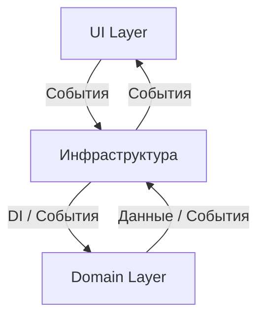
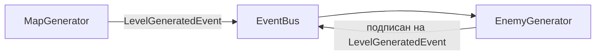
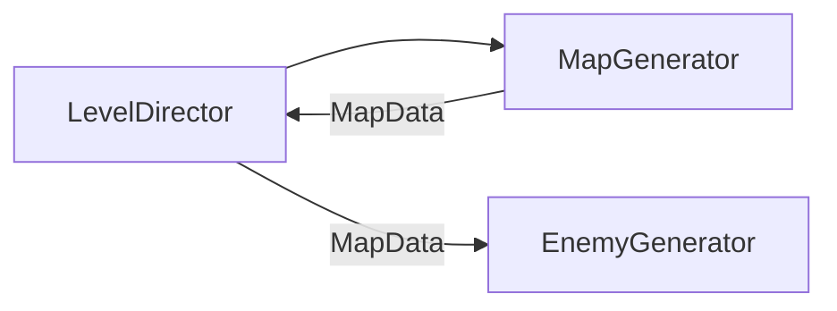
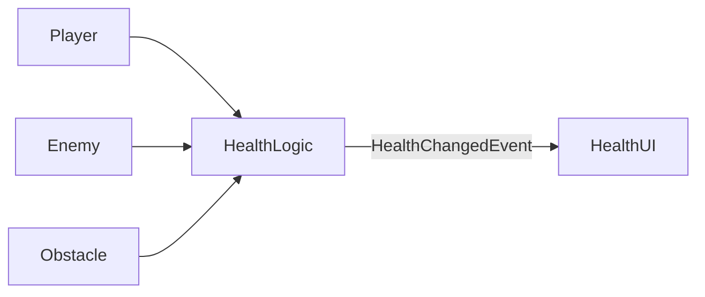

# Модульно-слойная архитектура Unity
Проект организован по трехслойной архитектуре: Инфраструктурный слой, Доменный слой и UI-слой. Каждый слой выполняет свою роль и взаимодействует с остальными через строго определенные интерфейсы и события, что обеспечивает слабую связность компонентов. Советую сразу пройтись по [терминам](#термины), это поможет в понимании данного документа.


## Инфраструктурный слой (Infrastructure) 
Инфраструктурный слой содержит технические сервисы и утилиты: шину событий (Event Bus), сервисы обмена данными между слоями, реализацию внешних API, менеджеры ресурсов, логирование, работу с файлами и, возможно, БД, управление сохранением/загрузкой данных. Этот слой не знает о деталях доменной логики и UI (то есть не зависит от Domain и UI). Его роль – посредник между слоями и внешней средой: он принимает и отправляет команды и события из домена/UI и общается с файловой системой, сетью и прочими ресурсами.  


## Доменный слой (Domain) 
Доменный слой реализует бизнес-логику[¹](#термины) приложения. Содержит сущности предметной области, доменные сервисы и бизнес-правила[¹](#термины). Доменный слой не имеет прямых зависимостей от UI и от конкретной реализации инфраструктуры. Все значимые действия и изменения состояния публикуются через инфраструктурную шину событий или другие инфраструктурные сервисы. Код доменного слоя полностью тестируемый и не зависит от Unity-специфичных классов. Например, контроллер-слой (аналог доменного слоя) «не содержит логики визуализации, а лишь управляет данными».  


## Слой пользовательского интерфейса (UI) 
Слой пользовательского интерфейся включает экраны, контроллеры (MonoBehaviour), элементы интерфейса и обработку ввода пользователя. UI-слой отвечает только за отображение данных и взаимодействие с игроком, не содержит бизнес-логики[¹](#термины). Он не знает о доменных сущностях напрямую – взаимодействие с бизнес-логикой[¹](#термины) происходит только через инфраструктуру (шину событий или DI-сервисы). Компоненты UI максимально автономны и слабо связаны друг с другом: каждый отвечает за свою часть интерфейса и получает данные из общего источника или по событиям. Например, MonoBehaviour должен лишь визуализировать данные, но не хранить их и не выполнять сложную логику.  



> Таким образом, инфраструктура выступает буфером и «смазкой» между слоями: Domain и UI не зависят друг от друга напрямую, а обмениваются информацией через общие сервисы (шину событий, менеджеры данных и т.п.) из Infrastructure.  

---

## Zenject и управление зависимостями
Для организации зависимостей внутри слоёв проекта и внедрения сервисов используется Zenject (контейнер внедрения зависимостей для Unity). Это позволяет применить принцип инверсии управления (IoC/DI): компоненты не сами создают необходимые сервисы, а получают их из Zenject-контейнера. Ключевые моменты использования Zenject в архитектуре:  
- Создание объектов через Zenject: как правило, все ненестатические объекты (сервисы, менеджеры, классы домена) создаются контейнером Zenject. Это упрощает передачу зависимостей через конструкторы или атрибут `[Inject]` и делает код легко тестируемым. Если класс не имеет никаких внешних зависимостей (его конструктор без параметров), можно создать его через `new` — но даже такие классы можно зарегистрировать в контейнере для единообразия.  
- Изоляция слоёв: по архитектурному правилу прямое связывание Domain и UI через Zenject недопустимо. Например, нельзя внедрять компонент UI в доменный сервис или наоборот. Так обеспечивается независимость слоёв (как в «Чистой архитектуре», где UI и Infrastructure могут зависеть от ядра, но не зависят друг от друга). Обмен между доменом и UI всегда идёт через инфраструктуру (события, общие сервисы).  
- Передача инфраструктурных сервисов: в то же время сервисы инфраструктуры (например, шина событий, DataManager, Config и т.п.) можно прокидывать во все слои через Zenject. Класс домена может иметь в конструкторе `ISignalBus` или `IResourceManager` – контейнер внедрит реализацию. Это соответствует идее Dependency Inversion: высокоуровневый слой (домен) работает через интерфейсы, а инфраструктурная реализация предоставляется через DI.  
- Автономность UI-компонентов: внутри UI-слоя Zenject также используется для связи между UI-модулями. Компоненты UI получают сервисы (например, данные с сервера, конфигурацию) через DI, но связи между разными экранами минимальны. Это облегчает переиспользование и тестирование интерфейсных частей.  

> Применение Zenject помогает соблюдать loose coupling: компоненты запрашивают абстракции, а конкретная реализация «прикручивается» в одном месте (контейнере), что облегчает замену и мокирование сервисов. Как отмечается в примерах архитектуры, встроенная поддержка DI делает слои слабо зависимыми и гибко настраиваемыми.  

## Модули
Модуль – это логически связанная группа классов и компонентов, объединённых одной функциональной задачей. Например, «система инвентаря» может быть отдельным модулем, или модуль «генератор карты». Принципы работы с модулями:  
- Инкапсуляция: детали реализации внутри модуля скрыты от внешних компонентов. Модуль общается с внешним миром через чётко определённые интерфейсы или события. Внутри модуля его компоненты (UI, логика, данные) могут активно взаимодействовать.  
- Единичная ответственность: каждый модуль решает одну конкретную задачу (например, управление инвентарём, обработка диалогов, генерация уровней и т.д.). Это упрощает поддержку и тестирование.  
- Независимость: модули должны быть максимально автономными друг от друга. Между модулями связи минимальны: если нужно обменяться данными, модули делают это через инфраструктурные сервисы или события, а не вызывают друг друга напрямую.  
- Внутри Unity: модуль может содержать несколько классов-сервисов и данных. Например, модуль «Генератор карты» может включать логику генерации, хранитель сгенерированной карты, и UI-инструменты для контроля генерации. Но всё это остаётся внутри модуля – внешние слои видят только его публичный API или события.  

> Такой модульный подход позволяет легко заменить часть функциональности (например, другой алгоритм генерации карты) без затрагивания остальной системы.  

## Системы
Система – это совокупность модулей, совместно реализующих более крупную функциональность проекта. Система может включать модули из разных слоёв (например, UI-модуль настроек, доменный модуль логики настроек и инфраструктурный DataManager). Основные принципы:  
- Разделение слоёв: модули внутри системы могут принадлежать разным слоям, но взаимодействие между этими слоями внутри системы идёт через инфраструктуру. То есть доменная часть системы не вызывает UI-модули напрямую, а обменивается данными через шину событий или сервисы Infra.  
- Ясная модульность: система делится на чётко отделённые модули с понятными обязанностями. Модули легко заменяются — например, можно создать альтернативный модуль генерации мира без изменения остальной системы.  
- Обмен через события: системы обмениваются информацией через шину событий. Каждый модуль публикует события (например, «уровень создан», «игрок получил урон» и т.д.), а другие подписанные модули получают данные и реагируют. Такой подход, например, используют Zenject Signals для лёгкой передачи уведомлений без жёстких связей.  
- Слабая связность между системами: разные системы проекта не знают подробностей работы друг друга. Между системами передаются только данные или события – например, система «Пользовательские настройки» может поменять параметры, а система «Графика» подписана и применит их, но они не вызывают методы друг друга напрямую.  

> Такой подход обеспечивает масштабируемость: новые системы и модули могут добавляться без изменения существующих, а тестировать и разрабатывать их можно по отдельности.  

**Взаимодействие и оркестрация систем**  
Системы приложения могут взаимодействовать разными способами, избегая жёсткой связи. Рассмотрим основные стратегии:  
- **Через событийную шину (Event Bus)**: компоненты различных систем общаются через общую шину событий инфраструктуры. Например, после создания карты модуль «Генератор карты» публикует событие с данными карты, а модуль «Генератор мобов» подписан на него и, получив данные, начинает создавать врагов на карте. Ни один из модулей не хранит ссылки на другой – обмен идёт через сообщение. Zenject Signals (или аналогичные системы сообщений) используются именно для такого лёгкого уведомления о событиях без передачи данных.


  
- **Оркестратор (дирижёр) систем**: создаётся специальный компонент (например, GameManager или LevelDirector), который управляет последовательностью действий в системах. Он может поочерёдно вызывать методы разных систем и передавать им результаты. Например, дирижёр сначала вызывает `GenerateMap()`, получает объекты карты, а затем передаёт их в `SpawnMobs(mapData)`. Генератор карты и генератор мобов сами друг о друге не знают – их связывает оркестратор. Такой паттерн упрощает последовательную работу систем и сохраняет их разобщённость.
  


- **Прямая DI-связь (когда уместно)**: если взаимодействие двух систем всегда детерминировано и предполагается жёсткая последовательность, можно внедрить одну систему в другую через Zenject. Например, напрямую передать интерфейс `IMobGenerator` в `MapGenerator`. Этот подход удобен для простоты, но его следует применять с осторожностью: он допустим только внутри одного слоя (или через общие интерфейсы), чтобы не нарушать принцип разделения слоёв. Если такой связи нет в требованиях или она может меняться, лучше использовать оркестратор или события.  

*Пример*: Есть система генерации уровня и система спавна врагов.  
- Вариант [¹](#термины) – событийный: система уровня публикует `LevelGeneratedEvent{levelData}`, а система врагов подписана и реагирует.  
- Вариант 2 – дирижёр: компонент `LevelManager` сначала вызывает генерацию уровня, получает `levelData`, затем явно вызывает `SpawnEnemies(levelData)`.  
В обоих случаях сами генератор уровня и спаунер врагов не знают друг о друге и работают только со своими входными/выходными данными.  

> Такой подход к оркестрации позволяет максимально ослабить связь между системами: они обмениваются только данными и реагируют на события, а не вызывают методы друг друга напрямую. Это делает архитектуру гибкой и расширяемой.

## Минимизация использования MonoBehaviour
MonoBehaviour-скрипты нужны Unity для прикрепления компонентов к игровым объектам, но они накладны. В официальной документации Unity указывается: «ScriptableObjects легче, чем MonoBehaviours, и не несут накладных расходов, связанных с последними»
Аналогично Zenject подчёркивает: иногда предпочтительнее избежать «избыточного веса» MonoBehaviour и использовать обычные C# классы
Таким образом бизнес-логику рекомендуется выносить в независимые классы (или ScriptableObject), а MonoBehaviour применять лишь для интеграции с Unity (отображение, ввод, управление сценой и т.д.).
### Примеры
**Пример (здоровье):** Логику «здоровья» можно вынести в отдельный класс или ScriptableObject (не желательно), а не использовать MonoBehaviour. Например, доменная модель[²](#термины) Health публикует события при получении урона, а MonoBehaviour-скрипт лишь визуализирует текущее значение. Компонент, отвечающий за здоровье и получение урона, можно прилепить и игроку, и противникам, и даже препятствиям. Сам MonoBehaviour может быть просто композитом, который содержит скрипт здоровья и предоставляет его другим объектам через интерфейсы (контракты).
Аналогичный подход используется и в других системах (очки опыта, инвентарь и т.д.): их данные остаются в простых классах или данных, а MonoBehaviour-скрипты только обрабатывают события.



### Примеры кода
**Плохо:**
```csharp
public class Player : MonoBehaviour
{
    // Движение
    public float speed = 5f;

    // Здоровье
    public int Health = 100;

    // Атака
    public int AttackDamage = 10;

    void Update()
    {
        HandleMovement();
        CheckHealth();
    }

    void HandleMovement()
    {
        float h = Input.GetAxis("Horizontal");
        float v = Input.GetAxis("Vertical");
        Vector3 move = new Vector3(h, 0, v) * speed * Time.deltaTime;
        transform.Translate(move);
    }

    void TakeDamage(int damage)
    {
        Health -= damage;
        if (Health <= 0)
        {
            Die();
        }
    }

    void Die()
    {
        Debug.Log("Player died");
    }

    void CheckHealth()
    {
        if (Health < 50)
        {
            Debug.Log("Health low!");
        }
    }

    void Attack()
    {
        Debug.Log("Player attacks for " + AttackDamage);
        // Логика атаки
    }
}
```

**Хорошо:**
```csharp
public interface IDamageable
{
    int CurrentHealth { get; }
    int MaxHealth { get; }

    void ApplyDamage(int amount);
    void Heal(int amount);

    event Action<int> OnHealthChanged; // new value
    event Action OnDeath;
}

public class Health
{
    public int Max { get; private set; }
    private int _current;
    public int Current => _current;

    public event Action<int> OnHealthChanged;
    public event Action OnDeath;

    public Health(int max)
    {
        Max = Math.Max(1, max);
        _current = Max;
    }

    public void ApplyDamage(int amount)
    {
        // Apply damage
    }

    public void Heal(int amount)
    {
        // Heal
    }
}

public class Player : IDamageable
{
    private readonly Health _health;
    public int CurrentHealth => _health.Current;
    public int MaxHealth => _health.Max;

    public event Action<int> OnHealthChanged;
    public event Action OnDeath;

    public Player(int maxHealth)
    {
        _health = new Health(maxHealth);
        _health.OnDeath += HandleDeath;
    }

    public void ApplyDamage(int amount) => _health.ApplyDamage(amount);
    public void Heal(int amount) => _health.Heal(amount);

    private void HandleDeath()
    {
        // domain reaction: e.g. set state, notify systems — не UI, не сцена
        // например: IsAlive = false; Respawn logic elsewhere.
    }
}

// И дургие сущности подобным образом
```
---

## Организация композитов и сервисов доменной логики

В текущей архитектуре важно четко определить, как именно доменная логика взаимодействует с остальными частями системы. Хотя в разделе "Минимизация использования MonoBehaviour" уже затронута идея выноса бизнес-логики из MonoBehaviour, необходимо подробнее раскрыть шаблон организации связующих компонентов между слоями.

### Два типа адаптеров для доменной логики

Для корректной изоляции доменного слоя и обеспечения слабой связности между компонентами системы используются два типа адаптеров:

#### 1. MonoBehaviour-композит (Scene-dependent)

Используется, когда логика зависит от сцены, игровых объектов или Unity-специфичных циклов (Update, OnCollision и т.д.). 

**Примеры использования:**
- Персонаж игрока
- Враги и NPC
- Объекты уровня, требующие физического взаимодействия

**Структура:**
```csharp
public class PlayerEntity : MonoBehaviour, IInitializable, ITickable
{
    [Inject] private readonly ISignalBus _signalBus;
    
    private readonly Health _health;
    private readonly Movement _movement;
    private readonly Combat _combat;

    public PlayerEntity()
    {
        _health = new Health(100);
        _movement = new Movement(5f);
        _combat = new Combat(10);
    }

    public void Initialize()
    {
        // Подписка на доменные события
        _health.OnDeath += HandleDeath;
        _health.OnHealthChanged += value => _signalBus.Fire(new HealthChangedSignal(value));
    }

    public void Tick()
    {
        // Передача Unity-специфичных данных в доменную логику
        var input = new Vector2(Input.GetAxis("Horizontal"), Input.GetAxis("Vertical"));
        _movement.UpdatePosition(transform, input);
    }

    // Публичный API для взаимодействия с другими компонентами
    public void ApplyDamage(int amount) => _health.ApplyDamage(amount);
    
    private void HandleDeath()
    {
        _signalBus.Fire<PlayerDeathSignal>();
        // Логика, специфичная для сцены
        Destroy(gameObject);
    }
}
```

#### 2. Сервис (Scene-independent)

Используется, когда логика не зависит от сцены и может существовать независимо от конкретных игровых объектов.

**Примеры использования:**
- Система квестов
- Менеджер достижений
- Экономика игры
- Система сохранения/загрузки

**Структура:**
```csharp
public class QuestService : IInitializable
{
    [Inject] private readonly ISignalBus _signalBus;
    
    private readonly QuestSystem _questSystem;

    public QuestService()
    {
        _questSystem = new QuestSystem();
    }

    public void Initialize()
    {
        // Подписка на доменные события
        _questSystem.OnQuestCompleted += questId => 
            _signalBus.Fire(new QuestCompletedSignal(questId));
        
        _questSystem.OnQuestStarted += questId => 
            _signalBus.Fire(new QuestStartedSignal(questId));
    }

    // Публичный API для взаимодействия с другими системами
    public void StartQuest(string questId) => _questSystem.StartQuest(questId);
    public void CompleteObjective(string questId, string objectiveId) => 
        _questSystem.CompleteObjective(questId, objectiveId);
}
```

### Общие обязанности адаптеров

Независимо от типа (MonoBehaviour или сервис), эти классы выполняют следующие ключевые функции:

1. **Хранение и предоставление доступа к доменным сущностям**
   - Адаптер содержит экземпляры доменных объектов (Health, QuestSystem и т.д.)
   - Не создает их самостоятельно, обычно инициализируется в конструкторе или через DI

2. **Предоставление публичного API**
   - Экспонирует методы для взаимодействия с доменной логикой
   - Пример: `ApplyDamage()`, `StartQuest()`, `CompleteObjective()`

3. **Обработка доменных событий**
   - Подписывается на события доменных объектов через `Action` или `event`
   - Преобразует доменные события в инфраструктурные (через шину событий или другие сервисы)
   - **Важно:** Доменная логика не знает об инфраструктуре напрямую

4. **Следование принципу единственной ответственности (SRP)**
   - Не создает доменные объекты (кроме случаев простой инициализации)
   - Не содержит бизнес-правил (только маршрутизацию событий и вызовов)
   - Не управляет жизненным циклом других систем

### Принцип изоляции доменного слоя

Ключевой аспект архитектуры — полная изоляция доменного слоя от инфраструктуры и UI:

- Доменные классы (Health, QuestSystem и т.д.) **не зависят от Unity API**
- Доменные классы **не используют шину событий напрямую**
- Все взаимодействие с инфраструктурой происходит через адаптер (композит или сервис)
- Адаптер выступает **единственным мостом** между доменом и остальной системой

Это обеспечивает:
- Полное тестирование доменной логики без Unity
- Возможность замены инфраструктурных реализаций
- Четкое разделение ответственностей
- Упрощение рефакторинга и расширения функциональности

### Рекомендации по именованию

Для единообразия в проекте рекомендуется использовать следующие соглашения:

- **{Сущность}Entity** — для MonoBehaviour-композитов, связанных со сценой
  Примеры: `PlayerEntity`, `EnemyEntity`, `ItemEntity`
  
- **{Сущность}Service** — для сервисов, не зависящих от сцены
  Примеры: `QuestService`, `InventoryService`, `AchievementService`

- **Просто {Сущность}** — допустимо, когда контекст ясен
  Примеры: `Quest`, `Inventory`, `Economy`

Имя должно четко отражать цель и область ответственности класса, избегая общих терминов вроде "Manager" или "Controller", если только это не соответствует реальной ответственности.

---

## Принцип выбора архитектуры
Хотя в документе описаны рекомендации по слоям, модулям, системам, Zenject и взаимодействию между ними, конечное решение о конкретной реализации архитектуры всегда остаётся за разработчиком или тим-лидом проекта.  
- Рекомендации служат ориентиром и помогают соблюсти слабую связность, модульность и управляемость системы.  
- В реальном проекте могут возникнуть ситуации, когда удобнее слегка отклониться от правил (например, использовать прямую DI-связь между системами для упрощения логики или ускорения разработки).  
- Выбор конкретных паттернов, способов оркестрации систем и детализации слоёв всегда определяется командой исходя из требований проекта, сроков и масштабируемости.  

*Идея*: документ задаёт архитектурный каркас и лучшие практики, но не заменяет здравый смысл и опыт разработчиков.  

## Итоговая концепция архитектуры
Архитектура проекта сочетает слоёвую структуру (Clean Architecture) и модульность (Modular / Future-based architecture), чтобы одновременно разделять ответственность и сохранять автономность компонентов.  
- Изоляция слоёв: UI, Domain и Infrastructure независимы друг от друга; взаимодействие происходит через Infrastructure Layer с передачей данных и событий.  
- Автономность модулей и систем: компоненты могут заменяться, масштабироваться и развиваться без влияния на остальную систему.  
- Управление зависимостями: Zenject внутри слоёв упрощает внедрение зависимостей и снижает связанность.  

**Баланс преимуществ**:  
- от слоевой архитектуры — строгая изоляция ответственности; при этом классическая слоёвая архитектура в Unity часто сложна в интеграции;  
- от модульной — гибкость и независимость модулей; классическая модульная архитектура не всегда обеспечивает изоляцию слоёв.  

> Эта структура делает код понятным, расширяемым и удобным для командной работы, обеспечивая предсказуемость поведения и лёгкость масштабирования проекта.

## Термины
1. Бизнес-логика (или предметная логика, domain logic) — это совокупность правил, алгоритмов и операций, которые описывают, как работает сама суть приложения или продукта, независимо от технологий, интерфейсов и платформы. Она отвечает на вопрос: “Что должен делать продукт и как он должен себя вести?”
2. Доменная модель — набор классов и данных, которые описывают объекты и правила предметной области (мира игры или бизнес-логики). Она содержит сущности (например, игрок, здоровье, инвентарь) и методы, реализующие правила взаимодействия между ними.
