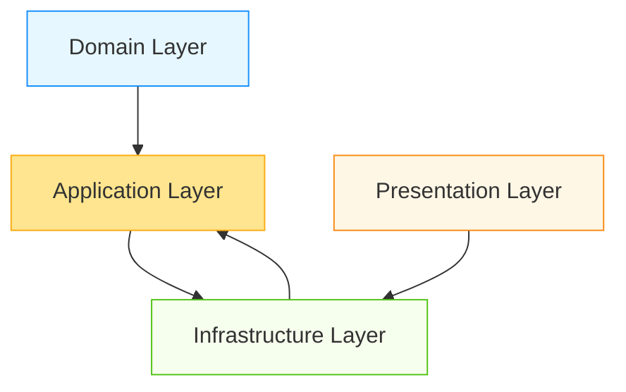
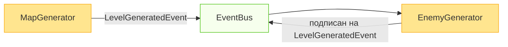
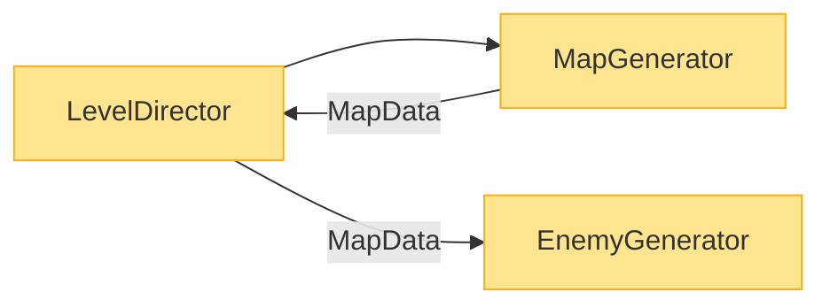

# Модульно-слойная архитектура Unity

Проект организован по четырехслойной архитектуре: Доменный слой, Прикладной слой (Application), Инфраструктурный слой и Presentation-слой. Каждый слой выполняет свою роль и взаимодействует с остальными через строго определенные интерфейсы и события, что обеспечивает слабую связность компонентов. Советую сразу пройтись по [терминам](#термины), это поможет в понимании данного документа.

## Почему именно эта архитектура?

### Почему не MVVM?
MVVM (Model-View-ViewModel) популярен в desktop- и мобильных приложениях, но имеет серьезные ограничения в Unity:

- **Производительность**: Системы привязки данных (binding) MVVM создают накладные расходы, которые критичны для игр с высокими требованиями к FPS
- **Сложная игровая логика**: Игровая логика часто требует низкоуровневого управления состоянием и синхронизации, что MVVM не поддерживает "из коробки"
- **Циклы обновления**: В Unity критически важно управление Update/FixedUpdate/LateUpdate, чего нет в классическом MVVM
- **Визуальные компоненты**: UI в играх гораздо сложнее, чем в обычных приложениях, и требует тесной интеграции с игровым миром

**Когда MVVM может быть уместен?** Для экранов настроек, меню, инвентаря — но только как часть Presentation-слоя, а не как основа всей архитектуры.

### Почему не MonoBehaviour + ScriptableObject?
Прямое использование MonoBehaviour и ScriptableObject без четкой структуры приводит к:

- **Спагетти-коду**: Сложность отслеживания потока данных между скриптами
- **Низкой тестируемости**: Логика, завязанная на MonoBehaviour, не может быть протестирована без запуска Unity
- **Повторному коду**: Один и тот же функционал копируется в разные скрипты
- **Проблемам с жизненным циклом**: Сложность управления порядком инициализации и уничтожения объектов

**Когда простой подход допустим?** Для маленьких проектов, прототипов, мини-игр, где срок жизни проекта короткий и сложность низкая.

### Какие проблемы решает эта архитектура?
- **Тестируемость**: Доменная логика может быть протестирована без запуска Unity
- **Масштабируемость**: Новые функции добавляются без переписывания существующего кода
- **Четкое разделение ответственности**: Каждый слой знает только о том, что ему необходимо
- **Упрощение командной работы**: Разработчики могут работать над разными слоями независимо
- **Гибкость изменений**: Можно заменить реализацию инфраструктуры без изменения бизнес-логики

## Когда эта архитектура избыточна?

Эта архитектура — не "серебряная пуля". Она может быть избыточной в следующих случаях:

- **Прототипирование**: Для быстрых прототипов или proof-of-concept лучше использовать простой подход MonoBehaviour
- **Мини-игры**: Проекты с ограниченной функциональностью и коротким сроком жизни
- **Сроки разработки**: Если проект имеет жесткие дедлайны и небольшой масштаб
- **Команда из 1-2 человек**: Для небольших команд сложность архитектуры может замедлить разработку

**Рекомендация**: Начинайте с упрощенной версии (например, без строгого разделения Domain/Application) и постепенно усложняйте архитектуру по мере роста проекта. Не усложняйте архитектуру ради самой архитектуры — делайте это только когда чувствуете, что текущая структура не справляется с растущей сложностью.

## Доменный слой (Domain)

Доменный слой реализует бизнес-логику[¹](#термины) приложения. Содержит сущности предметной области, доменные сервисы и бизнес-правила[¹](#термины). Ключевой момент: доменный слой полностью изолирован и не имеет зависимостей от каких-либо других слоев системы. Все значимые действия и изменения состояния публикуются через доменные события (Action/event), которые обрабатываются в прикладном слое. Код доменного слоя полностью тестируемый и не зависит от Unity-специфичных классов. Например, доменный класс «не содержит логики визуализации, а лишь управляет данными».

### Границы слоя — что НЕ должно быть в Domain
- **Нет** ссылок на Unity API (Transform, GameObject, Time и т.д.)
- **Нет** использования EventBus или инфраструктурных сервисов
- **Нет** логирования через Debug.Log или аналоги
- **Нет** ссылок на MonoBehaviour или ScriptableObject
- **Нет** прямых зависимостей от других слоев

## Прикладной слой (Application)

Прикладной слой (Application) является мостом между доменным слоем и остальной системой. Он отвечает за оркестрацию доменной логики и управление её жизненным циклом. Этот слой зависит от доменного слоя и инфраструктурного слоя, но не от Presentation-слоя.

Назначение слоя:
- Содержит композиты и сервисы, управляющие доменной логикой
- Включает `MonoBehaviour`-адаптеры (например, `PlayerEntity`) и C#-сервисы (например, `QuestService`)
- Отвечает за:
  - Подписку на события доменных сущностей (через `Action`/`event`)
  - Перенаправление событий в инфраструктуру (например, `EventBus`)
  - Предоставление API для Presentation-слоя и других систем
  - Управление жизненным циклом доменных сущностей
- Не содержит бизнес-правил — только оркестрацию
- Может быть привязан к сцене через `MonoBehaviour`, но не является частью Presentation-слоя

### Границы слоя — что НЕ должно быть в Application
- **Нет** прямого изменения Presentation-компонентов (например, через GetComponent)
- **Нет** реализации бизнес-правил — только оркестрация
- **Нет** прямых зависимостей от Presentation-слоя
- **Нет** логики, связанной с визуализацией или анимацией

### Два типа адаптеров для доменной логики

#### 1. MonoBehaviour-композит (Scene-dependent)
Используется, когда логика зависит от сцены, игровых объектов или Unity-специфичных циклов (Update, OnCollision и т.д.).

Примеры использования:
- Персонаж игрока
- Враги и NPC
- Объекты уровня, требующие физического взаимодействия

Структура:
```csharp
public class PlayerEntity : MonoBehaviour, IInitializable, ITickable
{
    [Inject] private readonly IEventBus _eventBus;
    
    private readonly Health _health;
    private readonly Movement _movement;
    private readonly Combat _combat;

    public PlayerEntity()
    {
        _health = new Health(100);
        _movement = new Movement(5f);
        _combat = new Combat(10);
    }

    public void Initialize()
    {
        // Подписка на доменные события
        _health.OnDeath += HandleDeath;
        _health.OnHealthChanged += value => _eventBus.Fire(new HealthChangedEvent(value));
    }

    public void Tick()
    {
        // Передача Unity-специфичных данных в доменную логику
        var input = new Vector2(Input.GetAxis("Horizontal"), Input.GetAxis("Vertical"));
        _movement.UpdatePosition(transform, input);
    }

    // Публичный API для взаимодействия с другими компонентами
    public void ApplyDamage(int amount) => _health.ApplyDamage(amount);
    
    private void HandleDeath()
    {
        _eventBus.Fire<PlayerDeathEvent>();
        // Логика, специфичная для сцены
        Destroy(gameObject);
    }
}
```

#### 2. Сервис (Scene-independent)
Используется, когда логика не зависит от сцены и может существовать независимо от конкретных игровых объектов.

Примеры использования:
- Система квестов
- Менеджер достижений
- Экономика игры
- Система сохранения/загрузки

Структура:
```csharp
public class QuestService : IInitializable
{
    [Inject] private readonly IEventBus _eventBus;
    
    private readonly QuestSystem _questSystem;

    public QuestService()
    {
        _questSystem = new QuestSystem();
    }

    public void Initialize()
    {
        // Подписка на доменные события
        _questSystem.OnQuestCompleted += questId => 
            _eventBus.Fire(new QuestCompletedEvent(questId));
        
        _questSystem.OnQuestStarted += questId => 
            _eventBus.Fire(new QuestStartedEvent(questId));
    }

    // Публичный API для взаимодействия с другими системами
    public void StartQuest(string questId) => _questSystem.StartQuest(questId);
    public void CompleteObjective(string questId, string objectiveId) => 
        _questSystem.CompleteObjective(questId, objectiveId);
}
```

### Общие обязанности адаптеров
Независимо от типа (MonoBehaviour или сервис), эти классы выполняют следующие ключевые функции:
- **Хранение и предоставление доступа к доменным сущностям**
  - Адаптер содержит экземпляры доменных объектов (Health, QuestSystem и т.д.)
  - Не создает их самостоятельно, обычно инициализируется в конструкторе или через DI
- **Предоставление публичного API**
  - Экспонирует методы для взаимодействия с доменной логикой
  - Пример: `ApplyDamage()`, `StartQuest()`, `CompleteObjective()`
- **Обработка доменных событий**
  - Подписывается на события доменных объектов через `Action` или `event`
  - Преобразует доменные события в инфраструктурные (через шину событий или другие сервисы)
  - Важно: Доменная логика не знает об инфраструктуре напрямую

### Принцип изоляции доменного слоя
Доменный слой должен оставаться полностью независимым и не иметь зависимостей от других слоев. Это обеспечивает:
- **Тестирование без Unity**: доменную логику можно тестировать в изоляции, без запуска Unity
- **Гибкость изменений**: бизнес-правила можно менять без затрагивания UI или инфраструктуры
- **Чистота архитектуры**: доменные объекты содержат только бизнес-логику, без технических деталей

Практическое правило: если ваш доменный класс использует что-то из Unity API, инфраструктурных сервисов или Presentation-слоя — это ошибка архитектуры. Все взаимодействие с внешним миром должно происходить через события и интерфейсы, реализованные в прикладном слое.

## Инфраструктурный слой (Infrastructure)

Инфраструктурный слой содержит технические сервисы и утилиты: шину событий (Event Bus), сервисы обмена данными между слоями, реализацию внешних API, менеджеры ресурсов, логирование, работу с файлами и, возможно, БД, управление сохранением/загрузкой данных. Этот слой предоставляет сервисы для Application и Presentation слоев, но не зависит от них.

Важно: инфраструктурный слой не знает о деталях доменной логики. Его роль — посредник между слоями и внешней средой: он принимает и отправляет команды и события из домена/Application и общается с файловой системой, сетью и прочими ресурсами.

### Границы слоя — что НЕ должно быть в Infrastructure
- **Нет** знания о доменных сущностях (должен работать с абстрактными событиями)
- **Нет** бизнес-логики — только техническая реализация
- **Нет** прямого доступа к Presentation-компонентам
- **Нет** реализации игровых механик

## Presentation-слой

Presentation-слой включает не только экраны и элементы интерфейса, но и аниматоры, визуальные эффекты и другие компоненты, отвечающие за отображение данных. Этот слой зависит только от инфраструктурного слоя через шину событий и сервисы, но не имеет прямых зависимостей от доменного или прикладного слоев.

Presentation-слой отвечает только за отображение данных и взаимодействие с игроком, не содержит бизнес-логики[¹](#термины). Он не знает о доменных сущностях напрямую – взаимодействие с бизнес-логикой[¹](#термины) происходит только через инфраструктуру (шину событий). Компоненты Presentation-слоя максимально автономны и слабо связаны друг с другом: каждый отвечает за свою часть интерфейса и получает данные из общего источника или по событиям. Например, MonoBehaviour должен лишь визуализировать данные, но не хранить их и не выполнять сложную логику.

### Границы слоя — что НЕ должно быть в Presentation
- **Нет** бизнес-логики — только визуализация
- **Нет** доменных объектов — только данные для отображения
- **Нет** прямого доступа к Application-адаптерам
- **Нет** изменения состояния игры (кроме ввода от пользователя)

### Пример аниматора в Presentation-слое
```csharp
public class PlayerAnimator : MonoBehaviour
{
    [Inject] private readonly IEventBus _eventBus;
    
    private Animator _animator;
    
    private void Awake()
    {
         _animator = GetComponent<Animator>();
    }

    public void Initialize()
    {
        // Подписка на события напрямую из инфраструктуры
        _eventBus.Subscribe<PlayerDeathEvent>(HandlePlayerDeath);
        _eventBus.Subscribe<HealthChangedEvent>(HandleHealthChanged);
    }

    private void OnDestroy()
    {
        _eventBus.Unsubscribe<PlayerDeathEvent>(HandlePlayerDeath);
        _eventBus.Unsubscribe<HealthChangedEvent>(HandleHealthChanged);
    }

    private void HandlePlayerDeath()
    {
        _animator.SetTrigger("Death");
    }

    private void HandleHealthChanged(HealthChangedEvent @event)
    {
        // Анимация эффекта урона при снижении здоровья
        if (@event.PreviousValue > @event.CurrentValue)
        {
            _animator.SetTrigger("Damage");
        }
    }
}
```

Этот аниматор напрямую реагирует на события через инфраструктурную шину, минуя прикладной слой, что упрощает архитектуру для чисто визуальных компонентов.

## Таблица границ слоёв

| Слой | Доменные сущности | События | Зависимости |
|------|-------------------|---------|-------------|
| **Domain** | Да | Нет (только доменные события через Action/event) | Нет (чистая C# логика) |
| **Application** | Да (адаптеры) | Да (для оркестрации) | Только Domain и Infra |
| **Infrastructure** | Нет | Да (реализация шины) | Нет (только предоставляет API) |
| **Presentation** | Нет (только визуализация) | Да (подписка на события) | Только через Infra |

## Взаимодействие слоёв



Таким образом:
- Domain является независимым ядром
- Application зависит от Domain и Infrastructure
- Infrastructure предоставляет сервисы Application и Presentation
- Presentation зависит только от Infrastructure

Все взаимодействие с инфраструктурой происходит через:
- Application слой (для бизнес-оркестрации и управления доменной логикой)
- Presentation слой (для визуальных реакций на события)

## Типичные ошибки при внедрении

### 1. Нарушение в Domain слое
**Ошибка**: Использование Unity API в доменных объектах

```csharp
// ПЛОХО: Domain слой не должен зависеть от Unity
public class Health
{
    public void ApplyDamage(int amount)
    {
        // Неправильно: использование Time.deltaTime в доменной логике
        float damageOverTime = amount * Time.deltaTime;
        _currentHealth -= (int)damageOverTime;
        
        // Неправильно: использование Debug.Log в доменном слое
        Debug.Log($"Health reduced to {_currentHealth}");
    }
}
```

**Решение**: Перенести тайминг в Application слой, логирование — в Infrastructure

### 2. Нарушение в Application слое
**Ошибка**: Прямое взаимодействие с Presentation-компонентами

```csharp
// ПЛОХО: Application слой не должен напрямую взаимодействовать с UI
public class PlayerEntity : MonoBehaviour
{
    private Health _health;
    private PlayerHealthUI _healthUI; // Прямая зависимость от UI
    
    public void Initialize()
    {
        _health = new Health(100);
        _health.OnHealthChanged += UpdateHealthUI; // Прямой вызов UI
    }
    
    private void UpdateHealthUI(int value)
    {
        // Прямое изменение Presentation-компонента
        _healthUI.SetHealth(value); 
    }
}
```

**Решение**: Использовать EventBus для оповещения об изменениях

### 3. Нарушение в Presentation слое
**Ошибка**: Прямая подписка на доменные события

```csharp
// ПЛОХО: Presentation слой не должен знать о доменных событиях
public class HealthUI : MonoBehaviour
{
    private PlayerEntity _player; // Прямая зависимость от Application
    
    private void Start()
    {
        // Прямая подписка на доменное событие
        _player.Health.OnHealthChanged += UpdateUI; 
    }
    
    private void UpdateUI(int value)
    {
        // Логика отображения
    }
}
```

**Решение**: Подписываться только на инфраструктурные события через EventBus

### 4. Нарушение модульной автономности
**Ошибка**: Вызов методов другого модуля через FindObjectOfType

```csharp
// ПЛОХО: Нарушение автономности модулей
public class QuestService : MonoBehaviour
{
    public void CompleteQuest(string questId)
    {
        // Прямой поиск и вызов другого модуля
        var inventory = FindObjectOfType<InventoryService>();
        inventory.GiveReward(questId);
    }
}
```

**Решение**: Использовать события для межмодульного взаимодействия

## Zenject и управление зависимостями

Для организации зависимостей внутри слоёв проекта и внедрения сервисов используется Zenject (контейнер внедрения зависимостей для Unity). Это позволяет применить принцип инверсии управления (IoC/DI): компоненты не сами создают необходимые сервисы, а получают их из Zenject-контейнера. Ключевые моменты использования Zenject в архитектуре:

- **Создание объектов через Zenject**: как правило, все ненестатические объекты (сервисы, менеджеры, классы домена) создаются контейнером Zenject. Это упрощает передачу зависимостей через конструкторы или атрибут `[Inject]` и делает код легко тестируемым.
- **Изоляция слоёв**: доменный слой не имеет зависимостей от других слоёв. Прикладной слой зависит от Domain и Infrastructure, но не от Presentation. Presentation зависит только от Infrastructure. Прямое связывание Domain с любым другим слоем через Zenject недопустимо.
- **Правильное использование DI**:
  - В прикладном слое можно внедрять как доменные объекты, так и инфраструктурные сервисы
  - В Presentation-слое внедряются только инфраструктурные сервисы
  - Доменный слой НЕ должен внедрять никакие сервисы из других слоёв
- **Автономность Presentation-компонентов**: внутри Presentation-слоя Zenject также используется для связи между UI-модулями. Компоненты получают сервисы (например, данные с сервера, конфраструктуру) через DI, но связи между разными экранами минимальны.

Применение Zenject помогает соблюдать loose coupling: компоненты запрашивают абстракции, а конкретная реализация «прикручивается» в одном месте (контейнере), что облегчает замену и мокирование сервисов.

## Как инициализировать систему при запуске?

Порядок инициализации критически важен для правильной работы архитектуры. Вот последовательность действий:

1. **Zenject-биндинги**: Настройка контейнера зависимостей
   - Регистрация сервисов и фабрик
   - Настройка жизненного цикла объектов
   - Пример: `Container.Bind<IEventBus>().To<EventBus>().AsSingle()`

2. **Создание Domain-объектов**:
   - Создание доменных сущностей через фабрики или напрямую
   - Инициализация начального состояния
   - Пример: `var player = new Player(100);`

3. **Инициализация Application-адаптеров**:
   - Создание и настройка MonoBehaviour-адаптеров и сервисов
   - Подписка на доменные события
   - Пример: `playerEntity.Initialize();`

4. **Подписка на события**:
   - Настройка обмена данными через EventBus
   - Пример: `_eventBus.Subscribe<PlayerDeathEvent>(HandleDeath);`

5. **Инициализация Presentation-компонентов**:
   - Подготовка UI и визуальных компонентов
   - Пример: `healthBar.Initialize();`

### Кто отвечает за жизненный цикл:

- **Initialize()**: 
  - Application-адаптеры (MonoBehaviour и сервисы)
  - Presentation-компоненты (UI, аниматоры)
  - Вызывается после создания всех зависимостей

- **Tick() / Update()**:
  - Только Application-адаптеры (MonoBehaviour)
  - Для передачи Unity-специфичных данных в доменную логику
  - Presentation-компоненты НЕ должны иметь Tick()

- **Dispose() / OnDestroy()**:
  - Application-адаптеры и Presentation-компоненты
  - Отписка от событий
  - Очистка временных ресурсов

## Модули

Модуль – это логически связанная группа классов и компонентов, объединённых одной функциональной задачей. Например, «система инвентаря» может быть отдельным модулем, или модуль «генератор карты». Принципы работы с модулями:

- **Инкапсуляция**: детали реализации внутри модуля скрыты от внешних компонентов. Модуль общается с внешним миром через чётко определённые интерфейсы или события. Внутри модуля его компоненты (Presentation, логика, данные) могут активно взаимодействовать.
- **Единичная ответственность**: каждый модуль решает одну конкретную задачу (например, управление инвентарём, обработка диалогов, генерация уровней и т.д.). Это упрощает поддержку и тестирование.
- **Независимость**: модули должны быть максимально автономными друг от друга. Между модулями связи минимальны: если нужно обменяться данными, модули делают это через инфраструктурные сервисы или события, а не вызывают друг друга напрямую.
- **Внутри Unity**: модуль может содержать несколько классов-сервисов и данных. Например, модуль «Генератор карты» может включать логику генерации, хранитель сгенерированной карты, и Presentation-инструменты для контроля генерации. Но всё это остаётся внутри модуля – внешние слои видят только его публичный API или события.

Такой модульный подход позволяет легко заменить часть функциональности (например, другой алгоритм генерации карты) без затрагивания остальной системы.

## Системы

Система – это совокупность модулей, совместно реализующих более крупную функциональность проекта. Система может включать модули из разных слоёв (например, Presentation-модуль настроек, доменный модуль логики настроек и инфраструктурный DataManager). Основные принципы:

- **Разделение слоёв**: модули внутри системы могут принадлежать разным слоям, но взаимодействие между этими слоями внутри системы идёт через прикладной и инфраструктурный слои. То есть доменная часть системы не вызывает Presentation-модули напрямую, а обменивается данными через шину событий или сервисы Infra.
- **Ясная модульность**: система делится на чётко отделённые модули с понятными обязанностями. Модули легко заменяются — например, можно создать альтернативный модуль генерации мира без изменения остальной системы.
- **Обмен через события**: системы обмениваются информацией через шину событий. Каждый модуль публикует события (например, «уровень создан», «игрок получил урон» и т.д.), а другие подписанные модули получают данные и реагируют. Такой подход, например, используют Zenject Events для лёгкой передачи уведомлений без жёстких связей.
- **Слабая связность между системами**: разные системы проекта не знают подробностей работы друг друга. Между системами передаются только данные или события – например, система «Пользовательские настройки» может поменять параметры, а система «Графика» подписана и применит их, но они не вызывают методы друг друга напрямую.

Такой подход обеспечивает масштабируемость: новые системы и модули могут добавляться без изменения существующих, а тестировать и разрабатывать их можно по отдельности.

## Взаимодействие и оркестрация систем

Системы приложения могут взаимодействовать разными способами, избегая жёсткой связи. Рассмотрим основные стратегии:

### Через событийную шину (Event Bus)
Компоненты различных систем общаются через общую шину событий инфраструктуры. Например, после создания карты модуль «Генератор карты» публикует событие с данными карты, а модуль «Генератор мобов» подписан на него и, получив данные, начинает создавать врагов на карте. Ни один из модулей не хранит ссылки на другой – обмен идёт через сообщение.



### Оркестратор (дирижёр) систем
Создаётся специальный компонент (например, GameManager или LevelDirector), который управляет последовательностью действий в системах. Он может поочерёдно вызывать методы разных систем и передавать им результаты. Например, дирижёр сначала вызывает `GenerateMap()`, получает объекты карты, а затем передаёт их в `SpawnMobs(mapData)`. Генератор карты и генератор мобов сами друг о друга не знают – их связывает оркестратор.



### Прямая DI-связь (когда уместно)
Если взаимодействие двух систем всегда детерминировано и предполагается жёсткая последовательность, можно внедрить одну систему в другую через Zenject. Например, напрямую передать интерфейс `IMobGenerator` в `MapGenerator`. Этот подход удобен для простоты, но его следует применять с осторожностью: он допустим только внутри одного слоя (или через общие интерфейсы), чтобы не нарушать принцип разделения слоёв.

Такой подход к оркестрации позволяет максимально ослабить связь между системами: они обмениваются только данными и реагируют на события, а не вызывают методы друг друга напрямую. Это делает архитектуру гибкой и расширяемой.

## Производительность и оптимизация

### Частота событий
- **Проблема**: События через EventBus имеют накладные расходы по сравнению с прямыми вызовами
- **Решение**: Не используйте события для частых обновлений (каждый кадр)
- **Рекомендация**: Используйте события для редких, значимых изменений (смерть игрока, завершение квеста), а для частых обновлений (каждый кадр) используйте прямые вызовы через интерфейсы

### Action vs EventBus
- **Action/event**: Быстрее, меньше накладных расходов, но создает прямую зависимость
- **EventBus**: Медленнее, но обеспечивает полную слабую связность
- **Рекомендация**: 
  - Используйте Action внутри одного модуля
  - Используйте EventBus для межмодульного взаимодействия
  - Для критичных по производительности частей (например, физика) используйте прямые вызовы

### Утечки памяти
- **Проблема**: Неочищенные подписки на события приводят к утечкам памяти
- **Решение**: Всегда отписывайтесь в OnDestroy или Dispose
- **Рекомендация**: Используйте методы Initialize/Dispose для управления подписками, а не Start/OnDestroy

### Оптимизация для мобильных устройств
- **Проблема**: Ограниченные ресурсы на мобильных устройствах
- **Решение**: 
  - Группируйте события (например, вместо 10 событий за кадр — одно с массивом данных)
  - Используйте object pooling для событий
  - Избегайте частых аллокаций в событиях

### Рекомендации по выбору механизма связи
| Сценарий | Рекомендуемый подход |
|----------|----------------------|
| Внутри одного модуля | Action/event |
| Межмодульное взаимодействие | EventBus |
| Критичные по производительности участки | Прямые вызовы через интерфейсы |
| Одноразовые события (инициализация) | EventBus |
| Частые обновления (каждый кадр) | Прямые вызовы или shared state |

## Минимизация использования MonoBehaviour

MonoBehaviour-скрипты нужны Unity для прикрепления компонентов к игровым объектам, но они накладны. В официальной документации Unity указывается: «ScriptableObjects легче, чем MonoBehaviours, и не несут накладных расходов, связанных с последними».

Аналогично Zenject подчёркивает: иногда предпочтительнее избежать «избыточного веса» MonoBehaviour и использовать обычные C# классы.

Таким образом бизнес-логику рекомендуется выносить в независимые классы (или ScriptableObject), а MonoBehaviour применять лишь для интеграции с Unity (отображение, ввод, управление сценой и т.д.).

Важное уточнение: MonoBehaviour-скрипты, которые выступают в роли композитов доменных сущностей, относятся к прикладному слою (Application), а не к Presentation-слою. Это ключевое различие, которое улучшает архитектуру:
- Presentation-слой содержит только компоненты, отвечающие за визуализацию и ввод
- Прикладной слой содержит MonoBehaviour, которые управляют доменной логикой и её жизненным циклом

### Примеры

**Пример (здоровье)**: Логику «здоровья» можно вынести в отдельный класс или ScriptableObject (не желательно), а не использовать MonoBehaviour. Например, доменная модель[²](#термины) Health публикует события при получении урона, а MonoBehaviour-скрипт лишь визуализирует текущее значение. Компонент, отвечающий за здоровье и получение урона, можно прилепить и игроку, и противникам, и даже препятствиям. Сам MonoBehaviour может быть просто композитом, который содержит скрипт здоровья и предоставляет его другим объектам через интерфейсы (контракты).

Аналогичный подход используется и в других системах (очки опыта, инвентарь и т.д.): их данные остаются в простых классах или данных, а MonoBehaviour-скрипты только обрабатывают события.


### Примеры кода

**Плохо**:
```csharp
public class Player : MonoBehaviour
{
    // Движение
    public float speed = 5f;

    // Здоровье
    public int Health = 100;

    // Атака
    public int AttackDamage = 10;

    void Update()
    {
        HandleMovement();
        CheckHealth();
    }

    void HandleMovement()
    {
        float h = Input.GetAxis("Horizontal");
        float v = Input.GetAxis("Vertical");
        Vector3 move = new Vector3(h, 0, v) * speed * Time.deltaTime;
        transform.Translate(move);
    }

    void TakeDamage(int damage)
    {
        Health -= damage;
        if (Health <= 0)
        {
            Die();
        }
    }

    void Die()
    {
        Debug.Log("Player died");
    }

    void CheckHealth()
    {
        if (Health < 50)
        {
            Debug.Log("Health low!");
        }
    }

    void Attack()
    {
        Debug.Log("Player attacks for " + AttackDamage);
        // Логика атаки
    }
}
```

**Хорошо**:
```csharp
public interface IDamageable
{
    int CurrentHealth { get; }
    int MaxHealth { get; }

    void ApplyDamage(int amount);
    void Heal(int amount);

    event Action<int> OnHealthChanged; // new value
    event Action OnDeath;
}

public class Health
{
    public int Max { get; private set; }
    private int _current;
    public int Current => _current;

    public event Action<int> OnHealthChanged;
    public event Action OnDeath;

    public Health(int max)
    {
        Max = Math.Max(1, max);
        _current = Max;
    }

    public void ApplyDamage(int amount)
    {
        // Apply damage
    }

    public void Heal(int amount)
    {
        // Heal
    }
}

public class Player : IDamageable
{
    private readonly Health _health;
    public int CurrentHealth => _health.Current;
    public int MaxHealth => _health.Max;

    public event Action<int> OnHealthChanged;
    public event Action OnDeath;

    public Player(int maxHealth)
    {
        _health = new Health(maxHealth);
        _health.OnDeath += HandleDeath;
        _health.OnHealthChanged += value => OnHealthChanged?.Invoke(value);
    }

    public void ApplyDamage(int amount) => _health.ApplyDamage(amount);
    public void Heal(int amount) => _health.Heal(amount);

    private void HandleDeath()
    {
        OnDeath?.Invoke();
        // domain reaction: e.g. set state, notify systems — не Presentation, не сцена
        // например: IsAlive = false; Respawn logic elsewhere.
    }
}

// И другие сущности подобным образом
```

## Как начать с этой архитектуры?

### Пошаговое руководство для новичков

1. **Создайте Domain-класс (например, Health)**
   ```csharp
   public class Health
   {
       public int Max { get; }
       private int _current;
       public int Current => _current;
       
       public event Action<int> OnHealthChanged;
       public event Action OnDeath;
       
       public Health(int max)
       {
           Max = max;
           _current = max;
       }
       
       public void ApplyDamage(int amount)
       {
           _current = Math.Max(0, _current - amount);
           OnHealthChanged?.Invoke(_current);
           
           if (_current <= 0)
           {
               OnDeath?.Invoke();
           }
       }
   }
   ```
   - Убедитесь, что класс не использует Unity API
   - Проверьте, что все зависимости — только через конструктор

2. **Создайте Application-адаптер (PlayerEntity)**
   ```csharp
   public class PlayerEntity : MonoBehaviour, IInitializable, ITickable
   {
       [Inject] private IEventBus _eventBus;
       
       private Health _health;
       
       public void Initialize()
       {
           _health = new Health(100);
           _health.OnDeath += HandleDeath;
           _health.OnHealthChanged += value => 
               _eventBus.Fire(new HealthChangedEvent(value));
       }
       
       public void Tick()
       {
           // Обработка ввода и передача в доменную логику
           float h = Input.GetAxis("Horizontal");
           float v = Input.GetAxis("Vertical");
           // ...передаем в Movement
       }
       
       private void HandleDeath()
       {
           _eventBus.Fire<PlayerDeathEvent>();
           Destroy(gameObject);
       }
   }
   ```
   - Убедитесь, что нет прямых ссылок на UI
   - Проверьте, что все Unity-специфичные операции в Tick()

3. **Настройте Zenject-биндинги**
   ```csharp
   public class GameInstaller : MonoInstaller
   {
       public override void InstallBindings()
       {
           // Инфраструктурные сервисы
           Container.Bind<IEventBus>().To<EventBus>().AsSingle();
           
           // Application слой
           Container.Bind<IInitializable>().To<PlayerEntity>().FromNewComponentOnNewGameObject().AsSingle();
           
           // Domain слой (если требуется)
           // Container.Bind<Health>().AsSingle(); // Не рекомендуется для доменных объектов
       }
   }
   ```
   - Убедитесь, что Domain-объекты не регистрируются в контейнере
   - Проверьте, что Presentation-компоненты не внедряются в Application

4. **Подпишитесь на событие через EventBus в Presentation**
   ```csharp
   public class HealthBar : MonoBehaviour
   {
       [Inject] private IEventBus _eventBus;
       
       private Slider _slider;
       
       private void Awake()
       {
           _slider = GetComponent<Slider>();
       }
       
       public void Initialize()
       {
           _eventBus.Subscribe<HealthChangedEvent>(OnHealthChanged);
       }
       
       private void OnDestroy()
       {
           _eventBus.Unsubscribe<HealthChangedEvent>(OnHealthChanged);
       }
       
       private void OnHealthChanged(HealthChangedEvent @event)
       {
           _slider.value = @event.Value;
       }
   }
   ```
   - Убедитесь, что подписка происходит только через Initialize()
   - Проверьте, что нет прямых ссылок на PlayerEntity

5. **Проверьте, что Domain не зависит от Unity**
   - Запустите unit-тесты для Health без запуска Unity
   - Убедитесь, что в классе нет ссылок на UnityEngine
   - Проверьте, что все события обрабатываются правильно

## Отладка и логирование

### Как отследить источник события?
- **Добавьте метаданные в события**: Расширьте базовый класс сигнала для включения информации об источнике
  ```csharp
  public class HealthChangedEvent
  {
      public int Value { get; }
      public string Source { get; } // Например, "Player", "Enemy"
      
      public HealthChangedEvent(int value, string source)
      {
          Value = value;
          Source = source;
      }
  }
  ```
- **Используйте отладочный режим шины событий**: Включите логирование всех событий в Development-сборках
  ```csharp
  public class EventBus : IEventBus
  {
      public void Fire<T>(T @event) where T : struct
      {
  #if DEBUG
          Debug.Log($"[EventBus] Firing {typeof(T).Name}");
  #endif
          // Логика отправки события
      }
  }
  ```

### Как избежать утечек памяти при подписках?
- **Всегда отписывайтесь в OnDestroy/Dispose**: Используйте парные методы Initialize/Dispose
  ```csharp
  public class HealthBar : MonoBehaviour
  {
      [Inject] private IEventBus _eventBus;
      
      public void Initialize()
      {
          _eventBus.Subscribe<HealthChangedEvent>(OnHealthChanged);
      }
      
      private void OnDestroy()
      {
          _eventBus.Unsubscribe<HealthChangedEvent>(OnHealthChanged);
      }
  }
  ```
- **Используйте Weak References для событий**: Для долгоживущих объектов
- **Регулярно проверяйте утечки**: Используйте профилировщик памяти Unity

### Где логировать ошибки?
- **Infrastructure слой**: Все технические ошибки (сеть, файлы, события)
  ```csharp
  public class EventBus : IEventBus
  {
      private readonly ILogger _logger;
      
      public EventBus(ILogger logger)
      {
          _logger = logger;
      }
      
      public void Fire<T>(T @event) where T : struct
      {
          try
          {
              // Отправка события
          }
          catch (Exception ex)
          {
              _logger.LogError($"Error firing event {typeof(T).Name}: {ex.Message}");
          }
      }
  }
  ```
- **Application слой**: Ошибки оркестрации и жизненного цикла
- **Domain слой**: Не логируйте ошибки в Domain — передавайте их через события

### Инструменты для отладки архитектуры
- **Визуализация событий**: Создайте инструмент в рантайме для отслеживания потока событий
- **Архитектурные тесты**: Напишите unit-тесты, проверяющие зависимости между слоями
  ```csharp
  [Test]
  public void DomainLayer_ShouldNotDependOnUnity()
  {
      var domainTypes = Assembly.GetAssembly(typeof(Health))
          .GetTypes()
          .Where(t => t.Namespace.Contains("Domain"));
          
      foreach (var type in domainTypes)
      {
          var references = type.GetReferencedAssemblies();
          Assert.False(references.Any(r => r.Name == "UnityEngine"));
      }
  }
  ```

## Принцип выбора архитектуры

Хотя в документе описаны рекомендации по слоям, модулям, системам, Zenject и взаимодействию между ними, конечное решение о конкретной реализации архитектуры всегда остаётся за разработчиком или тим-лидом проекта.

Рекомендации служат ориентиром и помогают соблюсти слабую связность, модульность и управляемость системы.

В реальном проекте могут возникнуть ситуации, когда удобнее слегка отклониться от правил (например, использовать прямую DI-связь между системами для упрощения логики или ускорения разработки).

Выбор конкретных паттернов, способов оркестрации систем и детализации слоёв всегда определяется командой исходя из требований проекта, сроков и масштабируемости.

Идея: документ задаёт архитектурный каркас и лучшие практики, но не заменяет здравый смысл и опыт разработчиков.

## Итоговая концепция архитектуры

Архитектура проекта сочетает слоёвую структуру (Clean Architecture) и модульность (Modular / Future-based architecture), чтобы одновременно разделять ответственность и сохранять автономность компонентов.

- **Изоляция слоёв**: Domain, Application, Infrastructure и Presentation независимы друг от друга; взаимодействие происходит через Application и Infrastructure Layers с передачей данных и событий.
- **Автономность модулей и систем**: компоненты могут заменяться, масштабироваться и развиваться без влияния на остальную систему.
- **Управление зависимостями**: Zenject внутри слоёв упрощает внедрение зависимостей и снижает связанность.

**Баланс преимуществ**:
- от слоевой архитектуры — строгая изоляция ответственности; при этом классическая слоёвая архитектура в Unity часто сложна в интеграции;
- от модульной — гибкость и независимость модулей; классическая модульная архитектура не всегда обеспечивает изоляцию слоёв.

Эта структура делает код понятным, расширяемым и удобным для командной работы, обеспечивая предсказуемость поведения и лёгкость масштабирования проекта.

## Термины

**Бизнес-логика (или предметная логика, domain logic)** — это совокупность правил, алгоритмов и операций, которые описывают, как работает сама суть приложения или продукта, независимо от технологий, интерфейсов и платформы. Она отвечает на вопрос: "Что должен делать продукт и как он должен себя вести?"

**Доменная модель** — набор классов и данных, которые описывают объекты и правила предметной области (мира игры или бизнес-логики). Она содержит сущности (например, игрок, здоровье, инвентарь) и методы, реализующие правила взаимодействия между ними.
